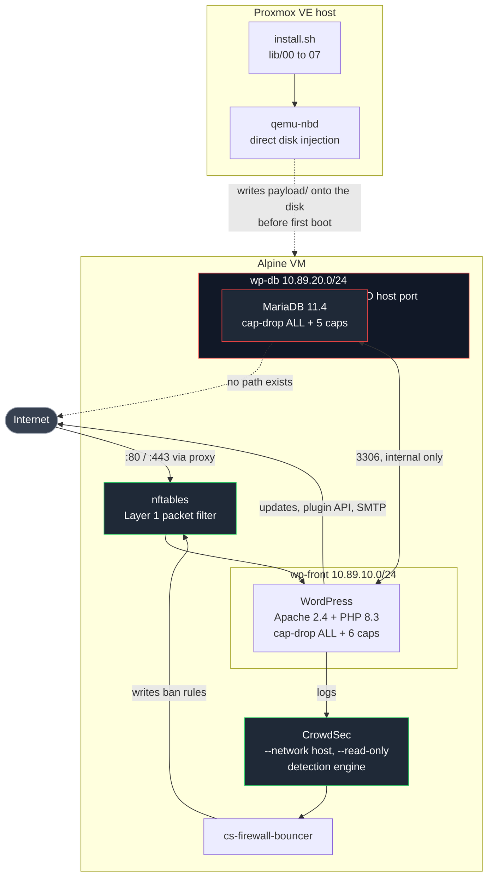
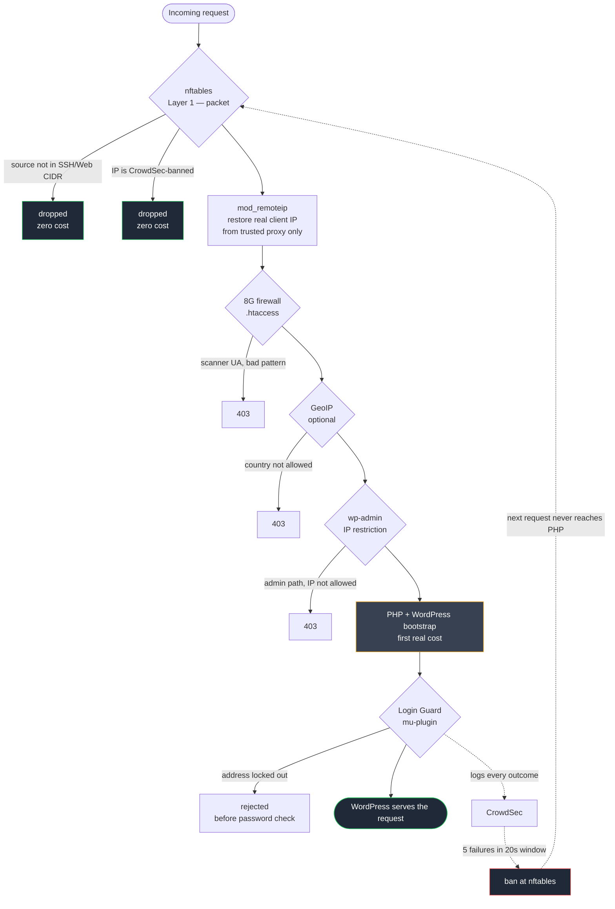
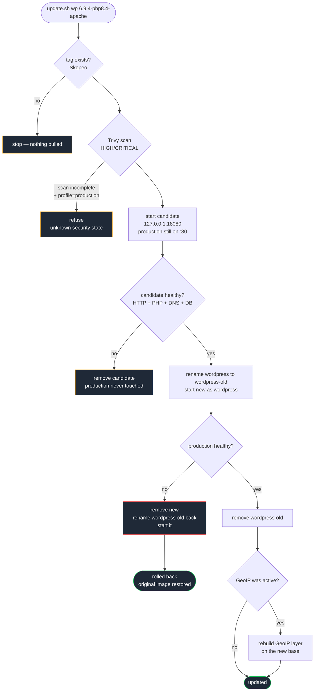
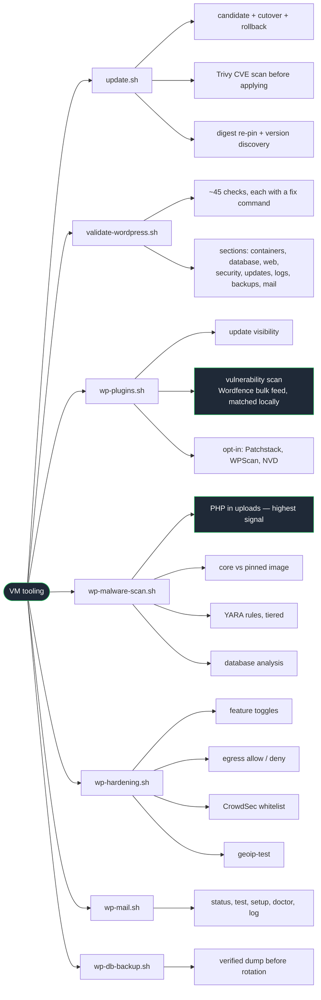

# Architecture

Diagrams render natively on GitHub. Four views, because one diagram covering
all of this would be unreadable: what exists, what a request passes through,
how it gets built, and how it changes safely.

---

## 1. Components and trust boundaries

The important structural fact is that **MariaDB has no route to the
internet and no host port**. It sits on a Podman `--internal` network, so a
compromised WordPress cannot reach past it and the database is not exposed
even if a firewall rule is wrong.

---

## 2. What a request passes through

Each layer is cheaper than the one after it. A packet dropped at nftables
costs nothing; a request that reaches PHP has already cost a WordPress
bootstrap and a database query. That ordering is the whole point — it is why
brute-force protection escalates from the application layer down to the
firewall rather than living only in PHP.

---

## 3. Install flow

Two phases, split by a reboot: the kernel switch has to happen before
containers exist.

```mermaid
flowchart LR
    subgraph P0["Proxmox host"]
        A["install.sh"] --> B["prompts<br/>lib/01"]
        B --> C["fetch Alpine<br/>verify SHA-512"]
        C --> D["build nftables +<br/>Apache config<br/>lib/03"]
        D --> E["mount disk<br/>qemu-nbd"]
        E --> F["inject payload/<br/>+ vars.sh"]
        F --> G["qm create + start"]
    end

    G --> H

    subgraph P1["VM — stage 1"]
        H["expand rootfs<br/>apk upgrade"] --> I["switch to linux-lts"]
        I --> J(["reboot"])
    end

    J --> K

    subgraph P2["VM — stage 2 : stages 01-10"]
        K["health checks<br/>kernel + Podman"] --> L["digest-pin images<br/>Skopeo"]
        L --> M["networks + secrets"]
        M --> N["Apache hardening<br/>8G, slug, CSP"]
        N --> O["MariaDB then WordPress<br/>then GeoIP"]
        O --> P["OpenRC services"]
        P --> Q["update + mail +<br/>plugin tooling"]
        Q --> R["CrowdSec + backups"]
        R --> S["Trivy, Lynis,<br/>malware scanner"]
        S --> T(["validate: ~45 checks"])
    end

    style J fill:#374151,stroke:#f59e0b,color:#fff
    style T fill:#1f2937,stroke:#22c55e,color:#fff
```

---

## 4. Update: candidate, cutover, rollback

Production keeps serving throughout the risky part. The old container is not
destroyed until the new one has proven itself — it *is* the rollback artifact.

---

## 5. Day-2 tooling

Each tool covers a layer the others do not. The split matters: `update.sh`
and Trivy see the **container image**, while plugins and themes live in a
mounted volume that an image update never touches — which is where roughly
91% of WordPress vulnerabilities are.

---

*Diagrams describe the system as built. If one disagrees with the code, the
code is right and the diagram is a bug — please report it.*

— **RothITguy**
