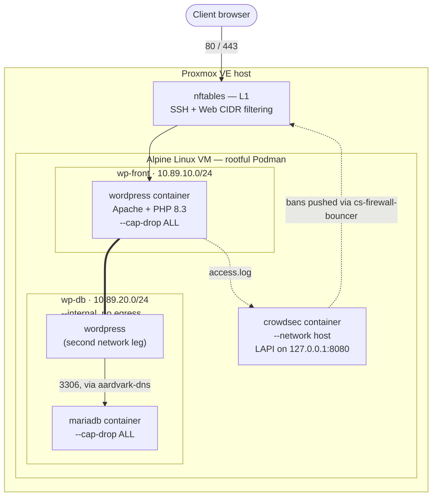

# WordPress VM Provisioner for Proxmox VE

A single Bash script (`wpinstall.sh`) that turns a bare Proxmox VE host into a fully provisioned, network-segmented WordPress VM — Alpine Linux, rootful Podman, MariaDB, and CrowdSec, with layered firewalling, SHA256 image pinning, optional GeoIP filtering, and a full day-2 update/rollback toolchain baked in.

No Ansible, no Terraform, no cloud-init dependency, nothing beyond what a Proxmox host already has. Answer a dozen interactive prompts and roughly 15 minutes later — most of it unattended — you have a WordPress site sitting behind its own firewall, intrusion-prevention engine, vulnerability scanner, and automated backups.

| | |
|---|---|
| **Host** | Proxmox VE (anything with `qm`, `pvesm`, `pvesh`) |
| **Guest OS** | Alpine Linux — auto-detects the newest available release (3.24 → 3.21), BIOS cloud image |
| **Container runtime** | Podman, **rootful only** |
| **Stack** | WordPress `6.9.4-php8.3-apache` · MariaDB `11.4` · CrowdSec `v1.7.8` |
| **Default sizing** | 2 vCPU · 4096 MB RAM · 20G disk (edit `CORES`/`RAM`/`DISK` at the top of the script to change) |
| **Networking** | Two segmented Podman networks — `wp-front` (egress + published port) and `wp-db` (`--internal`, no egress) |
| **Setup time** | ~15 minutes, mostly unattended after the prompts |
| **CLI flags** | None — the script is fully interactive |

---

## Table of Contents

- [What This Is](#what-this-is)
- [Architecture](#architecture)
- [Features](#features)
- [Requirements](#requirements)
- [Quick Start](#quick-start)
- [Interactive Setup Walkthrough](#interactive-setup-walkthrough)
- [What Gets Created](#what-gets-created)
- [Security Model](#security-model)
- [Day-2 Operations](#day-2-operations)
- [GeoIP Country Filtering](#geoip-country-filtering)
- [SHA256 Digest Pinning](#sha256-digest-pinning)
- [Automated Jobs](#automated-jobs)
- [File and Directory Reference](#file-and-directory-reference)
- [FAQ](#faq)
- [Troubleshooting](#troubleshooting)
- [Known Limitations](#known-limitations)
- [Credits](#credits)
- [License](#license)

---

## What This Is

Run the script on a Proxmox VE host as root. It will:

1. **Ask you a series of prompts** — VM sizing lives at the top of the script as variables (not a prompt), but networking, SSH access, firewall CIDRs, a custom `wp-admin` URL, CrowdSec enrolment, GeoIP filtering, and image-digest pinning are all configured interactively.
2. **Download and verify** the newest Alpine Linux cloud image directly from Alpine's CDN, checked against a freshly fetched SHA-512 sidecar.
3. **Inject a two-stage installer** straight into the disk image via `qemu-nbd` — no cloud-init involved (cloud-init is explicitly disabled on first boot).
4. **Create and start the VM** in Proxmox, then wait for it to come up and report its IP.
5. **Let the VM finish provisioning itself** on first boot:
   - *Stage 1* — expand the root filesystem, apply Alpine updates, switch to the `linux-lts` kernel if not already on it (reboots once if needed).
   - *Stage 2* — install Podman, create the two segmented container networks, stand up MariaDB → WordPress → CrowdSec, generate the nftables ruleset, install Trivy and Lynis, write out the `update.sh` / `wp-hardening.sh` / `validate-wordpress.sh` management scripts, and run a full post-install validation suite.

Everything is logged to `/var/log/wp-install.log` on the guest, viewable in real time via `qm terminal <VMID>`.

---

## Architecture



The key design decision is the **network split**. Earlier versions put WordPress and MariaDB on one flat network with a route to the internet — "no host port" kept MariaDB safe from *inbound* scans, but a compromised WordPress container still had a clear L2 path to the database subnet, which itself could still reach out. `wp-db` is created with `--internal`, so Podman/netavark never configures a route out of it at all, regardless of nftables state — MariaDB (and WordPress's second leg) has no egress, full stop.

---

## Features

**Provisioning**
- Auto-detects and downloads the newest available Alpine BIOS cloud image (tries `3.24` → `3.23` → `3.22` → `3.21`), with a pinned last-known-good fallback if the CDN listing can't be reached.
- SHA-512 integrity check against a freshly fetched sidecar from the same CDN directory (Alpine doesn't publish SHA-256 for cloud/qcow2 images — only SHA-512 and a detached GPG signature).
- Files are injected directly into the disk image via `qemu-nbd`; cloud-init is explicitly disabled on first boot.
- Two-stage first-boot installer, fully logged, idempotent enough to resume from `/var/lib/wp-install-stage` if the VM reboots mid-install.
- DHCP or static IPv4 addressing, chosen interactively; auto-detects the next free Proxmox VMID and the right disk options for your storage backend (`nfs`/`dir`/`btrfs`/block).

**Runtime**
- Rootful Podman only — the rootless code path was deliberately removed (see [Known Limitations](#known-limitations)).
- Every container runs `--cap-drop ALL` plus only the specific capabilities it needs, and `--security-opt no-new-privileges:true`.
- WP-Cron is disabled in favor of a real system cron job every 5 minutes — the standard fix for "WP-Cron only fires on page load."
- MariaDB's InnoDB buffer pool is capped (256M) so a busy site can't starve WordPress and CrowdSec of memory on a 4 GB VM.

**Security**
- nftables default-deny host firewall, generated with your CIDR choices baked in at install time.
- Apache-level IP restriction on `/wp-admin` and `wp-login.php`, independent of the network firewall and reverse-proxy-aware via `mod_remoteip`.
- Optional custom `/wp-admin` slug — a secret URL — with the default `/wp-admin` path returning `403` to anyone outside your allowed CIDR.
- The [8G Firewall](https://perishablepress.com/8g-firewall/) v1.4 `.htaccess` ruleset (query-string, request-URI, user-agent, method, and referrer filtering), placed ahead of WordPress's own rewrite block.
- [CrowdSec](https://www.crowdsec.net/) with the `apache2`, `wordpress`, `linux`, `sshd`, `http-cve`, and `appsec-wordpress` collections, enforced via a native nftables bouncer.
- Optional MaxMind GeoLite2 country allow/block-listing at the Apache module level, before PHP ever runs.
- A dedicated non-root SSH admin account (`wheel` + `doas`); root SSH login is disabled unconditionally in the normal path.
- Kernel hardening sysctls (`kptr_restrict`, `dmesg_restrict`, `yama.ptrace_scope`, `unprivileged_bpf_disabled`, the `fs.protected_*` family, and more).
- SHA256 digest pinning for all three images, resolved via Skopeo manifest queries rather than full pulls.
- [Trivy](https://github.com/aquasecurity/trivy) HIGH/CRITICAL CVE scanning gates every `update.sh` image swap.
- [Lynis](https://cisofy.com/lynis/) runs a weekly OS hardening audit for compliance evidence.

**WordPress hardening**
- `DISALLOW_FILE_EDIT`, capped post revisions, minor-only auto-updates, tuned memory limits, `WP_DEBUG` off by default.
- `wp-config.php`, `readme.html`, `license.txt`, and backup/dotfile patterns blocked at the Apache layer.
- PHP execution blocked inside `wp-content/uploads` — the single highest-impact rule against an uploaded webshell.
- `?author=N` user-enumeration blocked; `xmlrpc.php` blocked by default (toggle-able).
- Security headers via `mod_headers`: CSP, `X-Frame-Options`, `X-Content-Type-Options`, `Referrer-Policy`, `Permissions-Policy`.

**Day-2 tooling**
- `update.sh` — per-component updates, Trivy pre-scan, an exclusive lock, and a candidate/cutover pattern for WordPress so production never loses port 80 mid-update.
- `wp-hardening.sh` — toggle 8G Firewall / xmlrpc / uploads-PHP-execution / `WP_DEBUG`, callable remotely via `qm guest exec`.
- `validate-wordpress.sh` — a full health check across every layer, safe to run any time.
- `wp-geoip-setup.sh` — a rerunnable, idempotent GeoIP (re)installer.
- Daily MariaDB backups (7-day retention), weekly `podman auto-update --dry-run`, weekly Lynis audit.

---

## Requirements

- A Proxmox VE host you can reach as **root** (SSH, or the Proxmox web shell / `qm terminal`).
- `qm`, `pvesm`, `pvesh` — ship with Proxmox VE.
- `qemu-nbd`, `qemu-img` — `apt install qemu-utils` if missing.
- `openssl`, `curl`.
- Outbound internet access from the Proxmox host (Alpine's CDN) and from the guest during Stage 2 (Docker Hub, Alpine repos, GitHub for Trivy/Lynis fallback installers).
- A storage target with `images` content enabled (default offered: `local-lvm`).
- A bridge interface (default offered: `vmbr0`), optionally a VLAN tag.
- *(Optional)* a free [MaxMind](https://www.maxmind.com/en/geolite2/signup) account if you want GeoIP filtering.
- *(Optional)* a [CrowdSec Console](https://app.crowdsec.net/) enrolment key if you want the engine auto-enrolled.

---

## Quick Start

```bash
# Copy the script to your Proxmox host and run it as root
scp create-wordpress-vm-v7-8.sh root@your-proxmox-host:/root/
ssh root@your-proxmox-host
chmod +x create-wordpress-vm-v7-8.sh
./create-wordpress-vm-v7-8.sh
```

There are no command-line flags — everything is prompted for interactively, with sensible defaults shown in brackets that you can accept by pressing Enter. Resource sizing (2 vCPU / 4096 MB / 20G by default) is set at the top of the script in `CORES`, `RAM`, and `DISK` if you want different defaults before running it.

---

## Interactive Setup Walkthrough

In order, the script asks about:

1. **VM ID** — auto-suggested from `pvesh get /cluster/nextid`.
2. **Root password** (for local/console access — this is *not* used for SSH; see step 8).
3. **Hostname**, **storage target**, **bridge**, and an optional **VLAN tag**.
4. **Network mode** — DHCP, or static IPv4 (address, prefix, gateway, DNS servers).
5. **SSH public key** (paste, or a path to a `.pub` file) — or leave blank to use a password instead.
6. **Admin account username** (default `wpadmin`) — this becomes the `wheel`+`doas` account; if you supplied a key, its `doas` password is auto-generated and password SSH login is disabled entirely.
7. **Firewall CIDRs** — restrict SSH (22) and/or Web (80/443) at the packet level (blank = open to any source).
8. **Apache-level `wp-admin` restriction** — a CIDR and/or a single extra IP allowed to reach `/wp-admin` and `wp-login.php`, independent of the nftables rule above.
9. **Reverse proxy IP** — if set, `mod_remoteip` is configured so Apache trusts `X-Forwarded-For` from that address only.
10. **Custom `wp-admin` slug** — blank keeps the default `/wp-admin` path.
11. **CrowdSec Console enrolment key** — optional, masked input.
12. **GeoIP filtering** — enable/disable; if enabled, MaxMind Account ID + License Key, then a whitelist *or* blocklist of ISO country codes.
13. **SHA256 digest pinning** — on by default.
14. A full **summary screen**, then a final `Proceed? [Y/n]`.

---

## What Gets Created

**The VM** (via `qm create`): `--cpu host`, `virtio-scsi-single`, serial console (`--vga serial0 --serial0 socket`), QEMU guest agent enabled with `fstrim_cloned_disks=1`, `--onboot 1`, boots from `scsi0`.

**Containers**

| Container | Image | Network(s) | Published port | Notable flags |
|---|---|---|---|---|
| `wordpress` | `wordpress:6.9.4-php8.3-apache` (or a locally-built `wordpress-geoip:*` layer if GeoIP is enabled) | `wp-front` (primary) + `wp-db` | `80:80` | `--cap-drop ALL --cap-add NET_BIND_SERVICE,SETUID,SETGID,CHOWN,DAC_OVERRIDE,FOWNER`, 768 MB memory cap, 200 PID limit |
| `mariadb` | `mariadb:11.4` | `wp-db` only | none | `--cap-drop ALL --cap-add SETUID,SETGID,CHOWN,DAC_OVERRIDE,FOWNER`, 512 MB memory cap, InnoDB buffer pool capped at 256M |
| `crowdsec` | `crowdsecurity/crowdsec:v1.7.8` | host network | LAPI locked to `127.0.0.1:8080` | `--read-only --cap-drop ALL --cap-add DAC_OVERRIDE,SETUID,SETGID,CHOWN`, 512 MB memory cap |

**Networks**

| Network | Subnet | `--internal`? | Members | Purpose |
|---|---|---|---|---|
| `wp-front` | `10.89.10.0/24` | No | WordPress | Egress (plugin/theme installs, WP-Cron remote requests, update checks) + the published host port |
| `wp-db` | `10.89.20.0/24` | Yes | WordPress, MariaDB | Database traffic only — no route to the internet, ever, regardless of nftables state |

If digest pinning is enabled, all three images above are actually pulled and run by `repo@sha256:<digest>` reference, not by floating tag — see [SHA256 Digest Pinning](#sha256-digest-pinning).

---

## Security Model

| Layer | Component | Enforces |
|---|---|---|
| L1 | nftables | Default-deny host firewall; SSH/Web CIDR restriction; forward chain scoped to `wp-front`/`wp-db` only |
| L2 | Apache | `ADMIN_CIDR`/extra-IP restriction on wp-admin & wp-login.php, custom slug, 8G Firewall WAF, security headers, sensitive-file blocks |
| L3 | CrowdSec | Behavioral/signature banning — brute force, WAF-bypass CVEs, WordPress-specific attacks — enforced via an nftables bouncer |
| L4 | Podman | `--cap-drop ALL` + minimal capability grants, `no-new-privileges`, per-container network isolation, resource limits |
| L5 | Kernel | `rp_filter`, `syncookies`, `dmesg_restrict`, `ptrace_scope`, `fs.protected_*`, disabled unprivileged BPF, and more |
| L6 | SSH | Root login disabled, dedicated `wheel`+`doas` admin account, key-only auth when a key is supplied, restricted ciphers/KEX/MACs |

---

## Day-2 Operations

### `update.sh`

```
update.sh [check|status|os|wp [VER]|db [VER]|crowdsec [VER]|digest-check|all|trivy]
```

- **`check` / `status` / *(no args)*** — read-only. Skopeo manifest queries only, no pulls, no prompts. Shows what's running, what's pinned, and whether the registry has anything newer.
- **`os`** — Alpine `apk upgrade`.
- **`wp [VER]`** — pulls the new WordPress image, boots it as a throwaway `wordpress-candidate` on `127.0.0.1:18080` against the real data and database, and health-checks it there. Production is only stopped and swapped over once the candidate proves out — if it doesn't, production was never touched.
- **`db [VER]`** — takes a `mariadb-dump` backup, stops WordPress, stops MariaDB cleanly (verified stopped, not just renamed), swaps the image, re-verifies with a credentialed query + InnoDB check, restarts WordPress.
- **`crowdsec [VER]`** (alias `cs`) — same stop → verify-stopped → swap pattern; confirms LAPI comes back up and restarts the firewall bouncer.
- **`digest-check`** — refreshes any component whose tag was rebuilt under the same version (e.g. a same-version security rebuild), without touching OS packages.
- **`all`** — runs everything above in sequence; each step still asks before making a change.
- **`trivy`** — CVE-scans whatever images are actually running right now.

Every state-changing subcommand takes an exclusive lock at `/run/lock/wordpress-update.lock` (stale-PID-aware) so two invocations can never race each other.

### `wp-hardening.sh`

```
wp-hardening.sh [status|enable <feature>|disable <feature>|restart-wp|trivy-scan|lynis]
```

Features: `8g`, `xmlrpc`, `uploads-php`, `debug`. Can be run remotely from the Proxmox host itself:

```bash
qm guest exec <VMID> -- /usr/local/bin/wp-hardening.sh status
```

### `validate-wordpress.sh`

```
validate-wordpress.sh [--quiet]
```

Runs the full battery of checks — container status, DB reachability plus a real credentialed query and InnoDB check, full WordPress HTTP+PHP+DB health, uploads writability, port 80, nftables, CrowdSec bouncer, 8G Firewall presence, Trivy/Lynis availability, `WP_DEBUG` state. Exit code `0`/`1`, so it's safe to wire into external monitoring.

### `wp-geoip-setup.sh`

Rerunnable and idempotent. If GeoIP setup fails at install time (bad MaxMind credentials, a transient network blip), fix `/etc/wp-install/vars.sh` and re-run this one script — no reboot, no re-running the whole installer.

---

## GeoIP Country Filtering

Optional, off by default. When enabled:

- MaxMind's free **GeoLite2-Country** database is used via the `mod_maxminddb` Apache module, compiled from source in a multi-stage build so it survives future WordPress image updates without persistence hacks.
- Choose **whitelist** mode (only listed countries can reach the site) or **blocklist** mode (everyone *except* listed countries).
- Filtering happens at the Apache layer, before WordPress or PHP ever runs.
- The database refreshes automatically every Wednesday at 06:00 UTC.
- If it fails at install time, re-run `/usr/local/bin/wp-geoip-setup.sh` after fixing your credentials — check `/var/log/wp-geoip.log` for the exact failure.

---

## SHA256 Digest Pinning

On by default, togglable at the install prompt or afterward via `USE_DIGEST_PINNING` in `/etc/wp-install/vars.sh`.

- Digests are resolved with **Skopeo** (`skopeo inspect docker://...`), which asks the registry's manifest endpoint directly — a few KB, no image pulled just to check.
- A `podman pull` still happens, but only once, against the exact `repo@sha256:<digest>` reference that's actually going to run.
- The currently-pinned tag + digest per component is tracked in `/etc/wp-install/pinned.env`, which `update.sh` treats as the single source of truth.
- `update.sh digest-check` finds and offers to move to a newer digest published under the *same* tag — the case a plain version comparison would never catch (e.g. a same-version security rebuild).
- If Skopeo is unavailable or a lookup fails, pinning falls back to the older pull-then-inspect method automatically for that one image.

---

## Automated Jobs

| Schedule (UTC) | Job | What it does |
|---|---|---|
| Every 5 min | `wp-cron-run.sh` | Runs `wp-cron.php` inside the container — replaces unreliable page-load-triggered WP-Cron |
| Daily, 02:00 | MariaDB backup | `mariadb-dump --all-databases` → gzip → `/root/wp-db-backups/`, 7-day retention |
| Daily, 03:00 | Alpine security updates | `apk update && apk upgrade` |
| Weekly, Sun 04:00 | `podman auto-update --dry-run` | Logged only — nothing is applied automatically |
| Weekly, Wed 06:00 | GeoLite2-Country refresh | Only scheduled if GeoIP filtering is enabled |
| Weekly, Sat 05:00 | Lynis audit | Writes `/var/log/lynis-report.dat` — hardening index for compliance evidence |

---

## File and Directory Reference

| Path | Contents |
|---|---|
| `/root/.wp-credentials` | MariaDB root/WordPress passwords, table prefix (`chmod 600`) |
| `/root/.wp-admin-credentials` | The SSH admin account's `doas` password — only written when an SSH key was supplied (`chmod 600`) |
| `/etc/wordpress/env` | Env-file mounted into both the WordPress and MariaDB containers (`chmod 600`) |
| `/etc/wp-install/vars.sh` | Installer-time choices — slug, GeoIP, network mode, admin user, digest-pinning toggle — sourced by every management script |
| `/etc/wp-install/pinned.env` | Currently-pinned tag + digest per component; authoritative for `update.sh` |
| `/home/wpuser/wp/html` | WordPress files (bind-mount, UID 33 / `www-data`) |
| `/home/wpuser/wp/mysql` | MariaDB data directory (bind-mount, UID 999) |
| `/home/wpuser/wp/logs` | Apache access + `remoteip-debug` logs, read by CrowdSec |
| `/home/wpuser/wp/htaccess/.htaccess` | 8G Firewall + slug + author-enum rules, mounted read-write |
| `/home/wpuser/wp/apache-conf/wp-security.conf` | Generated Apache security config |
| `/var/log/wp-install.log` | Full first-boot install log |
| `/var/log/wp-digest-pinning.log` | Exact pull/resolve errors for anything that fell back to tag-only |
| `/var/log/wp-geoip.log` | GeoIP (re)install log |
| `/root/wp-db-backups/` | Daily gzipped MariaDB dumps, 7-day retention |

---

## FAQ

**Does this work on a non-Proxmox hypervisor?**
No — it's built directly on `qm`, `pvesm`, and `pvesh`.

**Is CrowdSec optional?**
No, the engine is always installed. Only Console *enrolment* (the key prompt) is optional.

**Can I skip GeoIP or digest pinning?**
Yes, both are opt-in/opt-out at the relevant prompt.

**Can I run more than one WordPress site per VM?**
Not by design — it's one install per VM, which is what keeps the network-segmentation and capability model simple and auditable.

**How do I resize the VM after it's created?**
Use normal Proxmox tooling (`qm set`, disk resize). The script's `CORES`/`RAM`/`DISK` variables only control the *initial* size.

**Can I point this at an Alpine VM I already have?**
No — the script builds the VM from a freshly downloaded Alpine cloud image and owns the whole disk-injection process.

---

## Troubleshooting

- **During first boot:** `qm terminal <VMID>`, then `tail -f /var/log/wp-install.log`.
- **Container status/logs:** `podman ps`, `podman logs wordpress`, `podman logs mariadb`, `podman logs crowdsec`.
- **Full health sweep:** `validate-wordpress.sh`.
- **Security feature status:** `wp-hardening.sh status`.
- **GeoIP failed:** fix `/etc/wp-install/vars.sh`, re-run `/usr/local/bin/wp-geoip-setup.sh`, check `/var/log/wp-geoip.log`.
- **Digest pinning partially failed:** check `/var/log/wp-digest-pinning.log` for the real pull/inspect error behind any component that fell back to tag-only.
- **An `update.sh` run seems stuck:** check for a stale lock at `/run/lock/wordpress-update.lock` — it's cleared automatically if the holding PID is dead, or remove it by hand if you're certain nothing is running.

---

## Known Limitations

This script has been through more than one structured security review. In the interest of setting accurate expectations before you point it at a client's production site, here's an honest breakdown of what's already solid and what isn't yet.

**Already addressed**
- WordPress updates use a candidate/cutover pattern — a freshly pulled image is booted and health-checked on a loopback-only port *before* production is touched, closing what used to be a guaranteed port-80 collision on every `update.sh wp`.
- Container rename/rollback failures are no longer swallowed — every rename/start in the update path is checked, and a failed rollback prints an explicit "ROLLBACK FAILED" with manual-recovery commands instead of silently claiming success.
- A dedicated non-root SSH account exists; root SSH login is disabled unconditionally in the normal path, with a `wheel`+`doas` admin account instead.
- Update operations are serialized behind an exclusive lock, and both MariaDB and CrowdSec are fully stopped — and verified stopped — before a replacement container is started against the same data/state.

**Not yet addressed but in progress**
- **MariaDB updates have no volume-level rollback.** The pre-update `mariadb-dump` backup isn't validated (no integrity check, no size/content check, and the pipeline isn't `pipefail`-protected, so a failed dump piped into a working `gzip` can still report success). If a rollback triggers, the "old" container restarts against the *same* data directory the new engine may have already modified.
- **`mariadb-upgrade` failures are ignored**, and **WordPress isn't health-checked after a MariaDB update** before the pre-update container is deleted — only MariaDB itself is re-verified.
- **A static `--add-host mariadb:...` entry persists** alongside DNS-based resolution, while MariaDB's replacement container is deliberately given a dynamic IP during updates — so the static entry can go stale, and can shadow the correct DNS answer, right after a DB update.
- **A few verification steps fail open rather than closed:** Alpine base-image SHA-512 verification and container digest pinning both fall back to running unverified with a warning, rather than aborting, if the check itself can't complete.
- **Some secrets land in a few places they shouldn't** — MaxMind credentials appear in a cron line and in process arguments, and installer-time values are interpolated into a sourced shell file without safe escaping.
- **`/etc/wp-install/pinned.env`** — the file `update.sh` treats as authoritative — **is written non-atomically** and isn't re-validated after being sourced back in.
- The Trivy fallback installer is fetched from a mutable branch with no checksum pinning, and a scanner failure is currently indistinguishable from an actual CVE finding.
- The WordPress HTTP health check accepts any response code except `500`/`000` — the PHP-execution, DNS, and real-database-query checks alongside it are stricter, but that one sub-check alone is permissive.
- The host's outbound firewall policy is fully open — there's no egress restriction toward other infrastructure on the network.

None of this is exotic to fix, and it's called out here rather than left implicit: the honest current state is a **solid pilot/lab build, not yet a "run it and forget it" for unattended production fleets.**

---

## Credits

- [8G Firewall](https://perishablepress.com/8g-firewall/) — Perishable Press (free for all use; credit kept intact in the generated `.htaccess`)
- [CrowdSec](https://www.crowdsec.net/)
- [MaxMind GeoLite2](https://www.maxmind.com/en/geolite2/geolite2-free-geolocation-data) (requires a free account and acceptance of MaxMind's EULA)
- [Trivy](https://github.com/aquasecurity/trivy) — Aqua Security
- [Lynis](https://cisofy.com/lynis/) — CISOfy
- [Alpine Linux](https://alpinelinux.org/)
- [Podman](https://podman.org)

---
