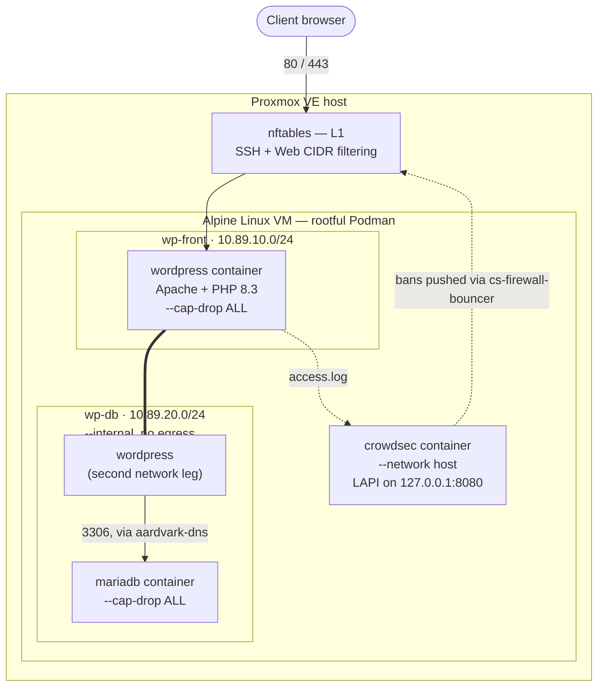

# WASP — WordPress Alpine Security Platform

*Hardened WordPress provisioning for Proxmox VE.*

A small, git-cloneable repository (`install.sh` plus `lib/` and `payload/`) that turns a bare Proxmox VE host into a fully provisioned, network-segmented WordPress VM — Alpine Linux, rootful Podman, MariaDB, and CrowdSec — with layered firewalling, SHA256 image digest pinning, optional GeoIP filtering, structurally-verified automated backups (see [Known Limitations](#known-limitations) for exactly what "verified" covers), and a full day-2 update/rollback/self-diagnosis toolchain baked in.

> **"~91% of WordPress vulnerabilities live in plugins — where most hardening never looks. This one does."**
> — RothITguy *(figure: Patchstack, State of WordPress Security in 2026)*

No Ansible, no Terraform, no cloud-init dependency, nothing beyond what a Proxmox host already has. Answer around 16 interactive prompts and roughly 15 minutes later — most of it unattended — you have a WordPress site sitting behind its own firewall, intrusion-prevention engine, vulnerability scanner, and nightly database backups that are integrity-checked on creation.

A note on how to read that sentence, and this README generally: "integrity-checked" means each backup's dump completion marker and gzip archive are verified before old backups are rotated — it does **not** mean the backup has been test-restored, or that a copy exists off this VM. Both of those are open items ([Known Limitations](#known-limitations), `TODO.md`). The same care applies elsewhere: the WordPress update "candidate" is isolated at the HTTP and filesystem level but shares the live database; CrowdSec provides firewall-level enforcement of ban decisions, not WAF request inspection; and rootful containers are contained primarily by the VM boundary rather than by the container runtime. Each of those is spelled out where it comes up below.

| | |
|---|---|
| **Host** | Proxmox VE (anything with `qm`, `pvesm`, `pvesh`) |
| **Guest OS** | Alpine Linux — auto-detects the newest available release (3.24 → 3.21), BIOS cloud image |
| **Container runtime** | Podman, **rootful only** |
| **Stack** | WordPress `6.9.4-php8.3-apache` · MariaDB `11.4` · CrowdSec `v1.7.8` |
| **Default sizing** | 2 vCPU · 4096 MB RAM · 20G disk (edit `CORES`/`RAM`/`DISK` in `lib/00-preflight.sh` to change) |
| **Networking** | Two segmented Podman networks — `wp-front` (egress + published port) and `wp-db` (`--internal`, no egress) |
| **Deployment profile** | `standard` (warn, don't abort, on a failed verification) or `production` (abort) — chosen at install time |
| **Setup time** | ~15 minutes, mostly unattended after the prompts |
| **CLI flags** | None — `install.sh` itself is fully interactive (the management scripts it installs are not — see [Day-2 Operations](#day-2-operations)) |

---

## Why I built this

I kept standing up WordPress for people and watching the same three failures, in the same order:

1. **A plugin was four versions behind** and something walked in through it. Nobody was looking at plugins — the host was patched, the container was scanned, and the actual door was wide open.
2. **The "backup" was an empty file.** It had been running nightly for a year. Nobody had ever restored one, and the cron job had been failing silently since the second week.
3. **An update broke the site**, at a bad hour, with no way back except a snapshot somebody hoped existed.

Every one-click installer I tried solved *"get WordPress running."* None of them solved *"still be running, still be yours, in six months."*

So this one is opinionated about the boring things, because the boring things are what actually fail: the database shouldn't be reachable from anywhere, an update should have to prove itself on a throwaway container before it touches production, and a backup nobody has checked is not a backup.

It's also honest about where it stops. Every control here states its own limits at the prompt, not buried in documentation — because a control you over-trust is worse than one whose edges you know. If a setting is noise reduction rather than a boundary, it says so before you rely on it.

— **RothITguy**

---

## Table of Contents

- [Why I built this](#why-i-built-this)
- [What This Is](#what-this-is)
- [Incident Playbook](INCIDENT-PLAYBOOK.md)
- [Architecture Diagrams](ARCHITECTURE.md)
- [Repository Structure](#repository-structure)
- [Architecture](#architecture)
- [Features](#features)
- [Requirements](#requirements)
- [Quick Start](#quick-start)
  - [Verifying what you run](#verifying-what-you-run)
- [Login Protection](#login-protection)
- [Plugin Vulnerability Scanning](#plugin-vulnerability-scanning)
- [Verifying What You Run](#verifying-what-you-run-minisign)
- [Vulnerability Exceptions](#vulnerability-exceptions)
- [Nginx Proxy Manager settings](#nginx-proxy-manager--recommended-configuration)
- [Off-VM Backup](#off-vm-backup)
  - [Creating the encryption key](#creating-the-encryption-key)
- [Self-Test](#self-test-proving-the-guarantees-hold)
- [Malware & Integrity Scanning](#malware--integrity-scanning)
- [Outbound Firewall (optional)](#outbound-firewall-optional)
- [Outbound Email](#outbound-email)
- [WordPress Site Address](#wordpress-site-address)
- [Interactive Setup Walkthrough](#interactive-setup-walkthrough)
- [What Gets Created](#what-gets-created)
- [Security Model](#security-model)
- [Day-2 Operations](#day-2-operations)
- [GeoIP Country Filtering](#geoip-country-filtering)
- [SHA256 Digest Pinning](#sha256-digest-pinning)
- [Deployment Profiles](#deployment-profiles)
- [Automated Jobs](#automated-jobs)
- [File and Directory Reference](#file-and-directory-reference)
- [FAQ](#faq)
- [Troubleshooting](#troubleshooting)
- [Known Limitations](#known-limitations)
- [Changelog Highlights](#changelog-highlights)
- [Credits](#credits)
- [License](#license)

---

## What This Is

Run `install.sh` on a Proxmox VE host as root. It will:

1. **Ask you a series of prompts** — VM sizing lives in `lib/00-preflight.sh` as variables (not a prompt); networking, SSH access, firewall CIDRs (format-validated, re-prompting on a bad value), a custom `wp-admin` URL, CrowdSec enrolment, GeoIP filtering, image-digest pinning, and a deployment profile are all configured interactively.
2. **Download and verify** the newest Alpine Linux cloud image directly from Alpine's CDN, checked against a freshly fetched SHA-512 sidecar.
3. **Inject a two-stage installer** straight into the disk image via `qemu-nbd` — no cloud-init involved (cloud-init is explicitly disabled on first boot).
4. **Create and start the VM** in Proxmox, then wait for it to come up and report its IP.
5. **Let the VM finish provisioning itself** on first boot:
   - *Stage 1* — expand the root filesystem, apply Alpine updates, switch to the `linux-lts` kernel if not already on it (reboots once if needed).
   - *Stage 2* — install Podman, create the two segmented container networks, stand up MariaDB → WordPress → CrowdSec, generate a syntax-checked nftables ruleset, configure hourly log rotation, install Trivy and Lynis, write out the `update.sh` / `wp-hardening.sh` / `validate-wordpress.sh` / `wp-db-backup.sh` management scripts, and run a full post-install validation suite.

Everything is logged to `/var/log/wp-install.log` on the guest, viewable in real time via `qm terminal <VMID>`.

---

## When something reports a finding

**[INCIDENT-PLAYBOOK.md](INCIDENT-PLAYBOOK.md)** — what each alert actually means, what to do first, and what *not* to do. Several of the tempting wrong moves destroy the evidence needed to stop a repeat.

Covers CRITICAL malware findings, vulnerability findings, backup failures, integrity failures and being locked out — plus a RACI so it's settled in advance who decides to take a site offline. At 02:00 is the wrong time to discover nobody can authorise it.

---

## Architecture

Four diagrams — components and trust boundaries, what a request passes through, the install flow, and the update/rollback path — are in **[ARCHITECTURE.md](ARCHITECTURE.md)**. They render on GitHub.

The one structural fact worth stating here: **MariaDB has no route to the internet and no host port.** It sits on a Podman `--internal` network, so a compromised WordPress cannot reach past it, and the database stays unexposed even if a firewall rule is wrong.

---

## Repository Structure

`install.sh` is a thin entry point. It sources `lib/*.sh` in numbered order to
build and inject the VM, and copies `payload/` onto the VM disk for the
in-VM installer to use on first boot. Nothing here is meant to be run out
of order or in isolation — each numbered file depends on variables and
functions earlier files set up, same as it would in one unsplit script.

Run standalone (the curl one-liner in [Quick Start](#quick-start)) with no
`lib/`/`payload/` next to it, `install.sh` fetches them itself — a
GitHub-generated tarball of this repo, into a temp directory removed when
the run finishes. Run from a full clone, it finds them right next to itself
and skips that step. Either way this is what actually gets used:

```
.
├── install.sh                 # entry point — run this
├── lib/                       # host-side (runs on the Proxmox host), sourced in order
│   ├── 00-preflight.sh          # colors/logging, VMID lookup, Alpine image detection, cleanup trap
│   ├── 01-interactive-setup.sh  # every prompt (networking, SSH, firewall, GeoIP, ...)
│   ├── 02-image-and-disk.sh     # Alpine download + SHA-512 verify + working-copy resize
│   ├── 03-dynamic-configs.sh    # builds nftables/Apache config blocks that need your answers baked in
│   ├── 04-nbd-mount-and-chroot.sh    # mounts the disk image, creates the admin account
│   ├── 05-ssh-and-network-inject.sh  # SSH hardening, credentials, nftables.nft, network config
│   ├── 06-vars-and-payload-inject.sh # vars.sh, stages payload/ onto the disk, first-boot launcher
│   └── 07-vm-create-and-start.sh     # qm create/importdisk/start, waits for an IP, prints the summary
├── payload/                    # copied onto the VM disk; the in-VM installer reads from here
│   ├── install-wordpress.sh     # in-VM installer entry point (Stage 2 dispatcher)
│   ├── stages/                  # install-wordpress.sh's own numbered stages (01-10)
│   ├── bin/                     # update.sh, validate-wordpress.sh, wp-hardening.sh, and the rest
│   │                             #   of the day-2 tooling — see Day-2 Operations below
│   ├── templates/                # the 2 files needing install-time values, as __TOKEN__ templates
│   ├── init.d/, cron/, apache-conf/, php-conf/, mariadb-conf/,
│   │   apache-mods/, mu-plugins/, crowdsec/, etc/    # static config files, copied verbatim
├── test/
│   ├── test-wordpress-vm.sh     # integration test harness (see test/README.md)
│   └── README.md
├── ARCHITECTURE.md             # Mermaid diagrams: components, request flow, install, updates
├── INCIDENT-PLAYBOOK.md        # what to do when a scan finds something; RACI
├── CHANGELOG.md                # what changed and why, including this restructuring
├── TODO.md                     # currently open items and why they're deferred
├── LICENSE                     # MIT
└── README.md                   # this file
```

None of this changes what ends up on the VM — every path in
[File and Directory Reference](#file-and-directory-reference) below, every
prompt, and every default is identical to before the split. See
`CHANGELOG.md` if you want the mechanical details of how the split was
done and verified.

---

## Architecture


```mermaid
flowchart TB
    client(["Client browser"])

    subgraph host["Proxmox VE host"]
        nft["nftables — L1<br/>SSH + Web CIDR filtering"]

        subgraph vm["Alpine Linux VM — rootful Podman"]
            subgraph frontnet["wp-front · 10.89.10.0/24"]
                wp["wordpress container<br/>Apache + PHP 8.3<br/>--cap-drop ALL"]
            end

            subgraph dbnet["wp-db · 10.89.20.0/24<br/>--internal, no egress"]
                wp2["wordpress<br/>(second network leg)"]
                db["mariadb container<br/>--cap-drop ALL"]
            end

            cs["crowdsec container<br/>--network host<br/>LAPI on 127.0.0.1:8080"]
        end
    end

    client -->|"80 / 443"| nft
    nft --> wp
    wp === wp2
    wp2 -->|"3306, via aardvark-dns"| db
    wp -.->|"access.log"| cs
    cs -.->|"bans pushed via cs-firewall-bouncer"| nft
```

The key design decision is the **network split**. Earlier versions put WordPress and MariaDB on one flat network with a route to the internet — "no host port" kept MariaDB safe from *inbound* scans, but a compromised WordPress container still had a clear L2 path to the database subnet, which itself could still reach out. `wp-db` is created with `--internal`, so Podman/netavark never configures a route out of it at all, regardless of nftables state — MariaDB (and WordPress's second leg) has no egress, full stop. `mariadb` is also given an explicit `--network-alias` on `wp-db`, so DNS resolution of the hostname `mariadb` doesn't depend on it happening to be the container's `--name`.

One consequence of running container-to-container DNS over a bridge gateway is worth calling out explicitly, because it caused a real install failure in the field: Podman's DNS resolver (aardvark-dns) runs *on the host*, bound to each network's gateway IP. A container's DNS query is therefore a packet hitting the host's own input chain, not the forward chain — so the host firewall has to explicitly permit it, or WordPress can never resolve `mariadb` even though MariaDB itself is perfectly healthy. The generated nftables ruleset now carries that accept rule (and the equivalent for DHCP) for both subnets, and it's syntax-checked with `nft -c` before it's ever loaded, so a malformed rule can't half-load and leave the firewall broken.

The other standing design decision is **rootful, not rootless, Podman** (see [Known Limitations](#known-limitations) for why rootless was removed). Every container still gets `--cap-drop ALL` plus only what it specifically needs: MariaDB adds back 5 capabilities and is isolated to `wp-db` (`--internal`, no host port, no egress); WordPress adds back 6, including `NET_BIND_SERVICE` — needed because Apache binds port 80 inside the container's own network namespace even with `-p 80:80` (Podman's host-side port publish and Apache's in-netns bind are separate things); CrowdSec runs `--network host` with minimal capabilities and `--read-only`, because it needs the host network namespace to see syslog and write nftables rules directly.

---

## Features

**Provisioning**
- Auto-detects and downloads the newest available Alpine BIOS cloud image (tries `3.24` → `3.23` → `3.22` → `3.21`), with a pinned last-known-good fallback if the CDN listing can't be reached.
- SHA-512 integrity check against a freshly fetched sidecar from the same CDN directory (Alpine doesn't publish SHA-256 for cloud/qcow2 images — only SHA-512 and a detached GPG signature). Whether a failed check aborts the install or just warns depends on the [deployment profile](#deployment-profiles).
- Files are injected directly into the disk image via `qemu-nbd`; cloud-init is explicitly disabled on first boot.
- Two-stage first-boot installer, fully logged, idempotent enough to resume from `/var/lib/wp-install-stage` if the VM reboots mid-install.
- DHCP or static IPv4 addressing, chosen interactively; auto-detects the next free Proxmox VMID and the right disk options for your storage backend (`nfs`/`dir`/`btrfs`/block).
- Every CIDR/IP prompt (SSH, Web, `wp-admin` CIDR, the extra allowed IP, the reverse-proxy IP) is format-validated at input time, re-prompting on anything malformed, instead of letting a typo reach a security-critical config file.

**Runtime**
- Rootful Podman only — the rootless code path was deliberately removed (see [Known Limitations](#known-limitations)).
- Every container runs `--cap-drop ALL` plus only the specific capabilities it needs, and `--security-opt no-new-privileges:true`.
- WP-Cron is disabled in favor of a real system cron job every 5 minutes — the standard fix for "WP-Cron only fires on page load."
- MariaDB's InnoDB buffer pool is capped (256M) so a busy site can't starve WordPress and CrowdSec of memory on a 4 GB VM.
- The host firewall explicitly permits container-to-gateway DNS (port 53) and DHCP on both container subnets — closing a real-world failure mode where WordPress could never resolve the `mariadb` hostname even though MariaDB itself was fully healthy.
- Podman's own container log files (stdout/stderr) are capped at 50 MB each via a `containers.conf.d` drop-in, independent of the Apache log rotation below — MariaDB and CrowdSec are both chatty on stdout and can otherwise grow unbounded in container storage.

**Security**
- nftables default-deny host firewall, generated with your CIDR choices baked in at install time and syntax-checked (`nft -c`) before it's ever loaded.
- Apache-level IP restriction on `/wp-admin` and `wp-login.php`, independent of the network firewall and reverse-proxy-aware via `mod_remoteip`.
- Optional custom `/wp-admin` slug — and it's a real boundary, not a cosmetic one: the default `/wp-login.php` returns `403` unless the request actually came through the slug's rewrite, and a must-use plugin keeps WordPress's own generated login/logout/redirect URLs pointed at the slug so the feature can't lock you out of your own site.
- The [8G Firewall](https://perishablepress.com/8g-firewall/) v1.4 `.htaccess` ruleset (query-string, request-URI, user-agent, method, and referrer filtering), placed ahead of WordPress's own rewrite block.
- [CrowdSec](https://www.crowdsec.net/) with the `apache2`, `wordpress`, `linux`, `sshd`, `http-cve`, and `appsec-wordpress` collections, enforced via a native nftables bouncer.
- Optional MaxMind GeoLite2 country allow/block-listing at the Apache module level, before PHP ever runs. Credentials are protected via a `--netrc-file`, never on a command line (see [GeoIP Country Filtering](#geoip-country-filtering)).
- A dedicated non-root SSH admin account (`wheel` + `doas`); root SSH login is disabled unconditionally in the normal path.
- Kernel hardening sysctls (`kptr_restrict`, `dmesg_restrict`, `yama.ptrace_scope`, `unprivileged_bpf_disabled`, the `fs.protected_*` family, and more).
- SHA256 digest pinning for all three images, resolved via Skopeo manifest queries rather than full pulls, and validated as a single well-formed digest before use.
- [Trivy](https://github.com/aquasecurity/trivy) HIGH/CRITICAL CVE scanning gates every `update.sh` image swap. The fallback installer is fetched from a specific, audited commit hash rather than a mutable branch, and a scanner failure is reported distinctly from an actual CVE finding rather than the two being conflated.
- [Lynis](https://cisofy.com/lynis/) runs a weekly OS hardening audit for compliance evidence.
- A `standard`/`production` [deployment profile](#deployment-profiles) toggle controls whether a failed image/digest verification is a warning or a hard install-time abort.

**WordPress hardening**
- `DISALLOW_FILE_EDIT`, capped post revisions, minor-only auto-updates, tuned memory limits, `WP_DEBUG` off by default.
- A randomized `wp<6 hex chars>_` table prefix rather than the well-known `wp_` default.
- `wp-config.php`, `readme.html`, `license.txt`, and backup/dotfile patterns blocked at the Apache layer.
- PHP execution blocked inside `wp-content/uploads` — the single highest-impact rule against an uploaded webshell.
- `?author=N` user-enumeration blocked; `xmlrpc.php` blocked by default (toggle-able).
- Security headers via `mod_headers`: CSP, `X-Frame-Options`, `X-Content-Type-Options`, `Referrer-Policy`, `Permissions-Policy`.

**Day-2 tooling**
- **`wp-mail.sh`** — outbound email status, live test send, reconfiguration, and diagnostics. See [Outbound Email](#outbound-email).
- **`wp-plugins.sh`** — WordPress-level update visibility: plugins, themes, and core. This covers a different layer than `update.sh`, and the difference matters. `update.sh` and Trivy cover the **container image** (OS packages, PHP, WordPress core). Plugins and themes live in the mounted `wp-content` volume, so an image update never touches them — and per Patchstack's *State of WordPress Security in 2026*, of the 11,334 vulnerabilities disclosed in 2025, roughly **91% were in plugins and 9% in themes, with about six in core**. `wp-plugins.sh status` shows what's out of date (including inactive plugins, whose code is still on disk and still reachable); a weekly cron reports pending updates via syslog. It **never auto-updates** — see [Known Limitations](#known-limitations) for why that's deliberate. Runs the official `wordpress:cli` image, digest-pinned like the other three.
- `update.sh` — per-component updates, Trivy pre-scan, an exclusive lock, and a candidate/cutover pattern for WordPress so production never loses port 80 mid-update. `all` and `digest-check` now run every component regardless of an earlier one failing, and print a per-component OK/FAILED summary at the end instead of stopping silently partway through.
- `wp-hardening.sh` — toggle 8G Firewall / xmlrpc / uploads-PHP-execution / `WP_DEBUG`, callable remotely via `qm guest exec`.
- `validate-wordpress.sh` (also `wp-validate`) — live functional checks across every layer, scoped to one area with `--section`, with a concrete copy-paste remediation command attached to every failure.
- `wp-geoip-setup.sh` — a rerunnable, idempotent GeoIP (re)installer.
- `wp-db-backup.sh` — the daily MariaDB backup, verified end-to-end (raw dump → completion-marker check → gzip integrity check → rotate-only-on-success) instead of trusting a piped `gzip`'s own exit code.
- `wp-health-check.sh` / `mariadb-health-check.sh` — the real functional health checks that gate every install-time wait loop and every `update.sh` rollback decision, available as standalone scripts you can run by hand.
- Daily verified MariaDB backups (7-day retention), weekly `podman auto-update --dry-run`, weekly Lynis audit, hourly log rotation.

---

## Requirements

- A Proxmox VE host you can reach as **root** (SSH, or the Proxmox web shell / `qm terminal`).
- `git`, to clone this repository.
- `qm`, `pvesm`, `pvesh` — ship with Proxmox VE.
- `qemu-nbd`, `qemu-img` — `apt install qemu-utils` if missing.
- `openssl`, `curl`.
- Outbound internet access from the Proxmox host (Alpine's CDN) and from the guest during Stage 2 (Docker Hub for images, Alpine repos, GitHub at a pinned commit for the Trivy fallback installer, and MaxMind if GeoIP filtering is enabled).
- A storage target with `images` content enabled (default offered: `local-lvm`).
- A bridge interface (default offered: `vmbr0`), optionally a VLAN tag.
- *(Optional)* a free [MaxMind](https://www.maxmind.com/en/geolite2/signup) account if you want GeoIP filtering.
- *(Optional)* a [CrowdSec Console](https://app.crowdsec.net/) enrolment key if you want the engine auto-enrolled.

---

## Quick Start

On your Proxmox host, as root — either the web UI (select your node → **Shell**) or SSH. Proxmox doesn't ship `git`, so the default path doesn't need it:

```bash
curl -fsSL -O https://raw.githubusercontent.com/RothITguy-jitsi/alpine-vm-wordpress/refs/heads/main/install.sh
chmod +x install.sh
./install.sh
```

`install.sh` notices it's on its own (no sibling `lib/`/`payload/`) and fetches the rest of the repository itself — a GitHub-generated tarball, not a `git clone`, so no `git` install is required on the host. That copy lives in a temp directory for the life of the install and is removed automatically when it finishes, same as every other temp file this creates. See [Verifying what you run](#verifying-what-you-run) below for the trust model and how to pin a specific commit instead of always fetching the latest `main`.

If you already have `git`, or want the full commit history for your own review, cloning works exactly the same way and skips the self-fetch entirely:

```bash
git clone https://github.com/RothITguy-jitsi/alpine-vm-wordpress.git
cd alpine-vm-wordpress
./install.sh
```

Either way, there are no command-line flags — everything is prompted for interactively, with sensible defaults shown in brackets that you can accept by pressing Enter. Resource sizing (2 vCPU / 4096 MB / 20G by default) is set in `lib/00-preflight.sh` in `CORES`, `RAM`, and `DISK` if you want different defaults before running it.

### Verifying what you run

The one-liner above downloads over HTTPS, which rules out tampering in transit, from whichever ref `install.sh` is told to fetch — `main` by default, i.e. whatever is on that branch right now. That's the right default for "always get the latest fixes," but it means a future compromise of this repo would be fetched by every install run from that point on, with nothing in the script itself to catch it — the same trust model as any other single-file `curl | bash` installer (Docker's, rustup's, Homebrew's all work the same way). No checksum published in this repo could change that, since a checksum sitting next to the code it's meant to verify only checks the repo against itself.

If you want a fixed, reviewable reference instead of "whatever `main` is today," pin to a specific commit SHA from this repo's own history:

```bash
WPVM_REPO_REF=<40-char-commit-sha> ./install.sh
```

(if you `sudo`'d into root rather than already being root, use `sudo -E` so the environment variable survives)

---

## Login Protection

The login page moves to a slug of your choosing. **The bare slug is the login URL** — `/kestrel`, not `/kestrel-login`.

```
/kestrel            -> the login page
/kestrel/foo        -> wp-admin/foo
/wp-login.php       -> 403
```

A `-login` suffix would defeat the point: anything scanning for paths matching `*login*` finds it in the same pass that finds `wp-login.php`. For the same reason the installer **rejects** slugs containing `login`, `admin`, `auth`, `signin`, `panel`, `dashboard` or `wp-` and asks again — a slug drawn from the wordlist that finds the default path hides it from nobody.


Replaces Limit Login Attempts and similar plugins, in two layers.

**Layer 1 — `02-wpvm-login-guard.php` (mu-plugin).** Progressive lockout: 5 failures in 20 minutes locks the address for 15 minutes, and each subsequent lockout doubles, capped at 24 hours. A fixed penalty is just a rate an attacker plans around — 5 guesses every quarter hour, forever. Doubling makes sustained guessing pointless while a legitimate mistyped password still costs only the base wait.

It also **removes WordPress's username-enumeration leak**: core distinguishes "Unknown username" from "the password you entered is incorrect", which confirms which accounts exist. Both now return identical text.

Tunable from `wp-config.php` without editing the file:

| Constant | Default |
|---|---|
| `WPVM_LOGIN_MAX_ATTEMPTS` | 5 |
| `WPVM_LOGIN_LOCKOUT_SECS` | 900 (15 min) |
| `WPVM_LOGIN_WINDOW_SECS` | 1200 (20 min) |
| `WPVM_LOGIN_MAX_LOCKOUT` | 86400 (24 h) |

### Not banning yourself

CrowdSec bans at **nftables**, which drops every packet from an address — SSH included. Mistype an admin password five times from your workstation and you lose access to the VM entirely, recoverable only from the Proxmox console.

The installer asks for a whitelist and pre-fills it with your reverse proxy and admin IP. **The proxy matters most**: if it's ever banned, the site goes down for every visitor simultaneously, because all traffic arrives from it.

```sh
wp-hardening.sh crowdsec-whitelist list          # whitelist + current bans
wp-hardening.sh crowdsec-whitelist add 1.2.3.4
wp-hardening.sh crowdsec-whitelist remove 1.2.3.4
doas podman exec crowdsec cscli decisions delete --ip 1.2.3.4   # unban without whitelisting
```

Written as a **postoverflow** whitelist, not a parser one. A parser-stage whitelist discards events before they reach a scenario, making whitelisted addresses completely invisible. At the postoverflow stage the alert is still raised and only the ban is suppressed — so if your own workstation is compromised and starts brute-forcing, it appears in `cscli alerts list` rather than having silent free rein. Not locking yourself out and not blinding yourself are both achievable; the parser stage would have traded the second for the first.

Prefer single addresses to ranges. Whitelisting a `/24` trusts every device on it, including the laptop that eventually gets malware.

**Layer 2 — CrowdSec.** The guard logs every outcome in a fixed format; a parser and scenario ship with the VM so CrowdSec reads them and bans the source **at nftables**. That difference matters: layer 1 still pays for a full WordPress bootstrap on every blocked attempt — PHP started, database queried, CPU spent. Under a distributed attack that cost *is* the attack. Layer 2 drops the packet before any of it happens.

```sh
doas podman exec crowdsec cscli decisions list        # who is banned
doas podman exec crowdsec cscli alerts list           # what triggered it
doas podman exec crowdsec cscli decisions delete --ip 1.2.3.4
```

**Why a mu-plugin and not a plugin:** a plugin is another update surface, another CVE surface, and can be switched off from an admin panel an intruder would reach immediately. mu-plugins can't be deactivated from wp-admin and survive core updates.

**`X-Forwarded-For` is deliberately not read in PHP.** `REMOTE_ADDR` is used, because mod_remoteip has already corrected it and only for the one proxy IP you declared trusted. Reading the header directly would accept it from anyone — letting an attacker send a fresh forged address per attempt and never accumulate a count. That's the most common way application-layer login limiters get defeated.

**On XML-RPC:** `xmlrpc.php`'s `system.multicall` allows hundreds of password attempts in a single request, which is how brute-force protection is usually bypassed. This VM blocks it in Apache already — check with `wp-hardening.sh status`.

---

## Plugin Vulnerability Scanning

`wp-plugins.sh status` shows what's *out of date*. `wp-plugins.sh vulns` shows what's actually **vulnerable** — matching installed plugins and themes against known-vulnerable version ranges.

| Source | Cost | Default | Notes |
|---|---|---|---|
| **Wordfence Intelligence** | Free (personal + commercial), **free account token required** | **Primary** | Fetched as one **bulk feed**, matched locally |
| **NVD** | Free | On demand (`vulns --nvd`) | Keyword matching only; sparse and noisy for WP plugins, rate-limited to 5 req/30s without a key |
| **Patchstack** | Free browse, commercial API | Opt-in | Often fastest on new disclosures |
| **WPScan** | Free tier (25 calls/day) | Opt-in | Long-standing; powers the WPScan CLI |

**A free Wordfence token is required.** The old v2 feed was open with no key and has been retired, so v3 with a token is the only way to read the database now. Generate one under **Integrations** in a free [Wordfence account](https://www.wordfence.com/products/wordfence-intelligence/). The installer asks for it alongside the CrowdSec enrolment key; add it later with `wp-plugins.sh set-key wordfence <token>`.

Without a token, `wp-plugins.sh status` (update availability) still works — you lose vulnerability matching only.

```sh
wp-plugins.sh vulns                          # scan (Wordfence)
wp-plugins.sh vulns --nvd                    # also query NVD
wp-plugins.sh vuln-sources                   # what's enabled and why
wp-plugins.sh set-key patchstack <key>       # opt in
wp-plugins.sh set-key wpscan <token>
wp-plugins.sh vuln-refresh                   # force a feed refresh
```

**Which feed?** Two exist, and the difference isn't just size:

| Feed | Contains | Trade-off |
|---|---|---|
| `scanner` *(default)* | Minimal detection format — **plus vulnerabilities still under research**, not yet in production | Detects **more**, and **earlier**. ~10 MB. Little detail per record. |
| `production` | Fully analysed: descriptions, CVSS vectors, references, patched versions | Better for deciding what to do and for client-facing evidence. A record only lands once analysis completes, so **on its own it can miss the newest issues**. 100 MB+. |
| `both` | Scanner for coverage, production for detail | No blind spot. Two downloads, more parse time. |

**Production is optional, and the reason is security before resources.** Using it *alone* narrows what you detect: a freshly disclosed plugin flaw is the one most likely to be under active exploitation, and that's exactly the record that hasn't finished analysis yet. Richer detail about issues you already know of is worth less than knowing about the one that landed today. Pick `both` if you want the detail without giving up the early warning — that costs disk and parse time rather than accuracy.

Change it later: `wp-plugins.sh set-key wordfence <token>` then edit `WORDFENCE_FEED` in `/etc/wp-install/vuln-sources.conf`.

**Wordfence is primary for a privacy reason as much as a cost one.** It's downloaded as a single complete feed and queried on the VM, so **your plugin inventory never leaves the machine** — the token authenticates the download, it doesn't report what you run. The **Scanner** feed is used rather than Production: Production carries full analysed records and is well over 100 MB, which is a poor thing to hand `jq` on a 4 GB VM, while Scanner is the minimal detection format *and* includes newly discovered vulnerabilities not yet fully analysed — smaller and earlier. The opt-in sources query per plugin slug, which discloses your exact attack surface to that provider. Reasonable trade for better coverage — but it should be your decision, so they're off by default.

Keys live in `/etc/wp-install/vuln-sources.conf` (0600, root-only).

### Email alerts

Scheduled jobs email you when they find something, using the same relay you configured for WordPress.

```sh
wp-notify.sh --status     # relay, recipient, cooldown, recent alerts
wp-notify.sh --test       # send a test alert now
```

| Job | Emails on |
|---|---|
| Vulnerability scan | any CRITICAL/HIGH/MEDIUM finding |
| Malware scan | **CRITICAL only** |
| Database backup | **any failure** — no cooldown |

**Sent host-side via `msmtp`, not through WordPress.** Reusing `wp_mail()` would be the tidier reuse, but these alerts fire when something is wrong — and "WordPress or MariaDB is down" is both the moment an alert matters most and the moment `wp_mail()` cannot run. Credentials come from the same `smtp.php` the mu-plugin uses; no second config is written, and the password reaches msmtp via `--passwordeval` rather than the argument list where `ps` would expose it.

**Alerts are deduplicated by content**, once per 24h by default. A daily scan that emails the same unpatched plugin every morning becomes a filter rule within a week — and then the finding that matters arrives unread. Change the findings and you get a new alert immediately; repeat the same ones and you don't.

Two deliberate exceptions:

- **Malware emails on CRITICAL only.** HIGH includes things like a world-writable file — worth fixing, not worth waking up for. Emailing those daily is how the CRITICAL mail stops being read.
- **Backup failure has no cooldown.** A repeated failure is exactly what you need to keep hearing about, and the error text is likely identical each night. A backup silently failing for months is the most common way people discover they have no backups, at the worst possible moment.

Not configured? Everything still logs to syslog — `doas grep -E 'wp-vulns|wp-malware|wp-db-backup' /var/log/messages`.

**Scheduled scans** (all times UTC):

| When | Job | Reports |
|---|---|---|
| Daily 06:30 | Vulnerability scan (Wordfence feed) | syslog `wp-vulns`, only on findings |
| Daily 03:30 | Malware scan — structural + core + DB | syslog `wp-malware`, only on findings |
| Sunday 03:45 | YARA signature scan | syslog `wp-malware`, only on findings |
| Monday 07:00 | Plugin/theme update availability | syslog `wp-plugins`, only when updates pending |
| Daily 02:00 | Verified database backup | — |
| Sunday 04:00 | Container image update check (dry run) | syslog `podman-autoupdate` |

Daily rather than weekly for vulnerabilities is deliberate: Wordfence adds dozens of records per week, and disclosure-to-exploitation for WordPress plugins is frequently measured in hours. A weekly scan can leave a known-exploited plugin live for six days.

Every job is **silent when there is nothing to report**. A daily "nothing found" trains you to ignore it, and an ignored alert is worse than none because it manufactures the feeling of monitoring.

```sh
doas grep wp-vulns /var/log/messages       # what the scan found
doas wp-plugins.sh vulns                   # run it now
```

Clean output means *no disclosed vulnerability in that feed* — not that the site is safe. Around 46% of plugin vulnerabilities have no patch when disclosed, and a plugin nobody has audited has no CVEs by definition.

*Vulnerability data from Wordfence Intelligence; records sourced from MITRE remain © MITRE Corporation.*

---

## Verifying What You Run (minisign)

`install.sh` fetches and executes code as root on your hypervisor. Every
`curl | bash` installer asks you to trust that the bytes arriving are the
bytes the author published — and normally there is no way to check.

WASP releases are signed, so there is.

### What happens automatically

Nothing to configure. `install.sh` verifies before it sources a single line:

```
  ✔ Embedded key matches the one published at minisign._wasp.rothitguy.pro
Verifying release signature…
Verifying file hashes against the signed manifest…
  All files match the signed manifest.
```

A bad signature or a changed file aborts the install. If you want it to refuse
to run on anything unsigned:

```sh
WASP_REQUIRE_SIGNATURE=1 ./install.sh
```

That needs `minisign` on the Proxmox host — `apt install minisign`. Without it
the install continues but says clearly that the signature was **not** checked,
rather than quietly reporting success.

### Checking it yourself

The key is published somewhere the repository is not, so you can confirm it
without taking this repo's word for it:

```sh
dig +short TXT minisign._wasp.rothitguy.pro
```

That should match the `WASP_PUBKEY` line in `install.sh`. If it doesn't, stop:
either the key was rotated and your copy is stale, or your copy did not come
from this project.

To verify a release by hand:

```sh
minisign -Vm MANIFEST.sha256 -P "$(dig +short TXT minisign._wasp.rothitguy.pro | tr -d '"')"
sha256sum -c MANIFEST.sha256
```

### What this proves — and what it doesn't

It proves the files about to run are byte-identical to what the key holder
signed. A tampered file that hasn't been re-signed fails, so an attacker needs
the **secret key**, not merely write access to the repository.

It does **not** bootstrap trust on its own. If you fetch `install.sh` and the
release from the same place, you are still trusting that place — someone who
could swap the tarball could swap the embedded key too. What signing changes is
that the swap becomes **detectable**: the key would have to change, and anyone
who recorded the fingerprint — or checks DNS, held under different credentials
— sees it.

Tamper-evidence, not prevention. Worth having; not the same as a trusted supply
chain, and this README would rather say so than imply otherwise.

The DNS cross-check is corroboration for the same reason: plain DNS is
spoofable on the network path, so it catches a repository compromise and not an
attacker who also controls your resolver.

### Checking the VM later

```sh
wasp-verify-integrity.sh
```

The more useful half. Verifying a download is a one-off; verifying the
**installed** files catches an attacker with root on the VM editing
`update.sh` or the malware scanner to disable a control. Those edits are
invisible to every other check here, because every other check trusts the
scripts it is running.

Its limit is stated in the script: an attacker with root can edit the checker
too. It catches malware that ignores integrity checking — most of it — not one
that anticipates it. For an authoritative answer, mount the disk from the
Proxmox host and compare from there.

---

### Nginx Proxy Manager — recommended configuration

Generate it filled in with your own values:

```sh
wp-hardening.sh nginx-snippet
```

What follows is the reference version. **Apply section A first, restart NPM, confirm the site still loads, then do section B.** A server block naming a `limit_req` zone that doesn't exist yet fails to load, and NPM answers **503 for the entire host** — the whole site, not just the admin path.

#### A. NPM host → `/data/nginx/custom/http_top.conf`

Create the file if it isn't there, then restart the NPM container.

```nginx
# POST only. An empty key is not rate limited, so every GET — the CSS, JS
# and images the login page pulls — passes freely.
map $request_method $wplogin_limit_key {
    POST    $binary_remote_addr;
    default "";
}
limit_req_zone $wplogin_limit_key zone=wplogin:10m rate=6r/m;
```

`limit_req_zone` lives in nginx's `http` block, which the Advanced tab cannot reach — that's why it needs its own file.

> **Why the `map`, and not just `$binary_remote_addr`.** `limit_req` returns **503 by default**, and a location matching `^/(wp-admin/|wp-login\.php|SLUG)` matches every asset the login page loads — a dozen or more requests. Keyed on the address alone, a 6-per-minute budget is spent by the page loading *itself*, and everything after gets 503 while the front page keeps working. Keying on POST counts only the actual login submission, which is the thing worth limiting.

#### B. Proxy host → Edit → **Advanced** tab → Custom Nginx Configuration

```nginx
# Admin paths, restricted at the EDGE.
# nginx is the edge, so $remote_addr IS the client — there is no header to
# trust and no substitution step that can fail silently. Apache enforces the
# same restriction independently; two layers that fail in different ways.
location ~* ^/(wp-admin/|wp-login\.php|YOUR-SLUG) {
    allow 192.168.100.0/24;      # your LAN
    allow 203.0.113.10;          # your public IP
    deny all;

    # Safe now that the zone keys on POST — assets are never counted.
    # Requires the map + zone from section A to exist first.
    limit_req zone=wplogin burst=5 nodelay;
    limit_req_status 429;   # not the default 503

    proxy_pass http://VM-IP:80;
    proxy_set_header Host              $host;
    proxy_set_header X-Real-IP         $remote_addr;
    proxy_set_header X-Forwarded-For   $remote_addr;
    proxy_set_header X-Forwarded-Proto $scheme;
    proxy_read_timeout 120s;
}

# Blocked in Apache too; stopping it here saves the round trip.
location = /xmlrpc.php { deny all; }

# Never serve these, whatever WordPress or a plugin thinks.
location ~* ^/(wp-config\.php|readme\.html|license\.txt)$ { deny all; }
location ~* /\.(git|env|svn|ht) { deny all; }

# Uploads should never execute.
location ~* ^/wp-content/uploads/.*\.(php|phtml|phar|php[0-9])$ { deny all; }
```

**On `X-Forwarded-For $remote_addr`** — NPM defaults to `$proxy_add_x_forwarded_for`, which *appends* to whatever the client sent, so a forged header arrives as `<forged>, <real>`. mod_remoteip should still choose correctly, but only while `RemoteIPTrustedProxy` is exactly right. Replacing states the truth and removes the class.

#### Also worth enabling on the proxy host

| Setting | Why |
|---|---|
| **Block Common Exploits** | Cheap, catches obvious probes before they reach the VM |
| **Websockets Support** | Only if a plugin needs it — off otherwise |
| **Force SSL** + **HTTP/2** + **HSTS** | The VM sets `FORCE_SSL_ADMIN` when a proxy is configured; without Force SSL you get redirect loops |
| **Cache Assets** | Optional. Don't enable it if a plugin serves dynamic content from `/wp-content/` |

#### If you get 503 after applying any of this

**503 is not the IP restriction** — that returns 403. It means one of three things:

1. **`limit_req` is rejecting you.** This is the common one, and its default status *is* 503. If the zone keys on the client address rather than POST, loading the login page exhausts the budget on its own assets. Use the `map` in section A and set `limit_req_status 429` so a rate limit is at least distinguishable from an outage.
2. nginx's config failed to load — usually a `limit_req` zone that doesn't exist yet.
3. nginx genuinely can't reach the backend.

To tell 1 from 2 and 3, ask the VM directly — this bypasses nginx entirely:

```sh
doas podman exec wordpress php -r '
$c=stream_context_create(["http"=>["timeout"=>8,"ignore_errors"=>true]]);
@file_get_contents("http://127.0.0.1/wp-login.php",false,$c);
echo ($http_response_header[0]??"none")."\n";'
```

**403 or 200 from inside means the VM is fine and the 503 is nginx.** A 403 there is correct — the request comes from an address that isn't in your allow list.

1. Clear the Advanced tab, save, confirm the site returns
2. Reapply **one block at a time**, restarting NPM between each
3. The usual cause is a `limit_req` zone that doesn't exist yet

If the site is still 503 with an empty Advanced tab, the problem is on the VM:

```sh
doas podman ps -a --format '{{.Names}} {{.Status}}'
doas podman exec wordpress apache2ctl configtest
doas podman logs --tail 40 wordpress
```

### Hardening at the proxy

```sh
wp-hardening.sh nginx-snippet
```

Prints Nginx Proxy Manager config filled in with this VM's actual admin CIDR, allowed IP, login slug and address — generated rather than documented, because a snippet transcribed by hand with one value wrong is worse than none: it looks configured.

**Why restricting at nginx beats the Apache rule.** Apache only knows the client IP because a *header* told it. nginx is the edge — `$remote_addr` **is** the client. No header to trust, no substitution step to fail silently. Keep both; two layers that fail independently.

It also sets `X-Forwarded-For $remote_addr` rather than NPM's default `$proxy_add_x_forwarded_for`, which **appends** to whatever the client sent — so a forged header arrives as `<forged>, <real>`. mod_remoteip should still pick correctly, but only if `RemoteIPTrustedProxy` is exactly right. Replacing states the truth and removes the class.

And an edge rate limit (6/min per real IP) that costs no WordPress bootstrap — the one control here that holds even if everything downstream is misconfigured, since it never touches `X-Forwarded-For`.

**What it doesn't fix:** the login guard, CrowdSec and GeoIP still identify clients from `X-Forwarded-For`, so they still depend on mod_remoteip. The snippet makes that header trustworthy; it doesn't remove the dependency. That's stated in the output too.

## Vulnerability Exceptions

Accepting a HIGH or CRITICAL finding in order to update is sometimes the right call — the fix may not exist yet. What must not happen is that it becomes a private decision nobody sees again.

There is no approval workflow here, deliberately: that belongs in whatever process you already use, and a half-built one inside an installer would be worse than none. What this does is make the decision **recorded, scoped, expiring and visible**.

```sh
wp-hardening.sh exceptions          # every exception, with status
wp-hardening.sh exceptions-check    # the weekly cron entry point
```

Accepting a finding requires a written justification of at least 15 characters, and records:

| Field | Why |
|---|---|
| **Image digest** | The exception applies to *that image only*. A different image has different vulnerabilities; a blanket "yes" outliving its subject is how exceptions become policy by accident |
| **The CVE list** | So a reviewer can tell whether the reason still applies — the only question a review actually asks |
| **Who accepted it** | |
| **Expiry** (90 days default) | Without it, the first person to type a reason decides forever |

An unexpired exception for the same digest is honoured without re-asking — re-prompting for a recorded decision is how people learn to type anything to get past a prompt. An expired one says so and must be re-argued.

**The log is the record; the email is a copy.** Mail fails, and an audit trail that depends on delivery isn't one. `/var/log/wasp-vuln-exceptions.log` is append-only and root-owned.

Notices go to the governance address collected at install — with a warning if it matches the admin address, since a record only the decision-maker receives is a diary rather than oversight. The email now carries **the actual CVEs accepted**, so it's reviewable without SSHing in.

A weekly job (Monday 08:00 UTC) emails when an exception lapses within 14 days — enough notice to re-argue it before an update is blocked by it. Silent otherwise.

---

## Off-VM Backup

Optional at install. Nightly backups are written to the VM's own disk, which covers a bad update or a dropped table — and nothing else.

| Method | Use when |
|---|---|
| `scp` | Simplest. An SSH key and a remote path. |
| `rsync` | Same transport, resumes interrupted transfers. Better over a slow link. |
| `rclone` | S3, B2, Wasabi and ~40 other providers, plus SFTP. Object storage. |

```sh
wasp-offsite-backup.sh test      # prove the destination works, end to end
wasp-offsite-backup.sh verify    # is the newest local backup actually there?
wasp-offsite-backup.sh list
wasp-offsite-backup.sh status
```

Sent automatically after each verified nightly backup, and `wasp-selftest.sh` checks the newest backup exists remotely at the right size.

### Creating the encryption key

**Do this on your own machine, not the VM.** The VM must only ever hold the
public half — that's what makes a root compromise there unable to read your
backups. `wasp-offsite-backup.sh init` refuses a private key if you paste one
by mistake.

<details>
<summary><b>Linux</b></summary>

| Distribution | Install |
|---|---|
| Debian 12+ / Ubuntu 22.04+ | `sudo apt install age` |
| Fedora / RHEL / Rocky | `sudo dnf install age` |
| Arch / Manjaro | `sudo pacman -S age` |
| openSUSE | `sudo zypper install age` |
| Alpine | `sudo apk add age` |
| Bazzite / Silverblue (immutable) | `brew install age` — avoids `rpm-ostree` and a reboot |

If your distribution's `age` is missing or old, the release binary always works:

```sh
curl -LO https://github.com/FiloSottile/age/releases/latest/download/age-v1.2.1-linux-amd64.tar.gz
tar xzf age-v1.2.1-linux-amd64.tar.gz
sudo install -m755 age/age age/age-keygen /usr/local/bin/
```

Check the [releases page](https://github.com/FiloSottile/age/releases) for the current version — the filename above will go stale.

</details>

<details>
<summary><b>macOS</b></summary>

```sh
brew install age
```

Or MacPorts: `sudo port install age`

No Homebrew? Use the darwin build from the [releases page](https://github.com/FiloSottile/age/releases) — `arm64` for Apple Silicon, `amd64` for Intel.

</details>

<details>
<summary><b>Windows 11</b></summary>

```powershell
winget install FiloSottile.age
```

Or with Scoop: `scoop install age`

If neither is available, download `age-vX.Y.Z-windows-amd64.zip` from the [releases page](https://github.com/FiloSottile/age/releases), extract it, and run the commands from that folder — or add it to `PATH`.

**Close and reopen PowerShell** after installing, or `age-keygen` won't be found.

</details>

<details>
<summary><b>Windows Server</b></summary>

`winget` isn't present on most Server installations, so use the release binary:

```powershell
$v = "v1.2.1"   # check the releases page for the current version
Invoke-WebRequest -Uri "https://github.com/FiloSottile/age/releases/download/$v/age-$v-windows-amd64.zip" -OutFile age.zip
Expand-Archive age.zip -DestinationPath C:\age
cd C:\age\age
.\age-keygen.exe -o wasp-backup-key.txt
```

If `Invoke-WebRequest` fails on an older Server with a TLS error:

```powershell
[Net.ServicePointManager]::SecurityProtocol = [Net.SecurityProtocolType]::Tls12
```

</details>

#### Generate it

Same command everywhere (`.\age-keygen.exe` on Windows):

```sh
age-keygen -o wasp-backup-key.txt
```

It prints one line to the terminal:

```
Public key: age1ql3z7hjy54pw3hyww5ayyfg7zqgvc7w3j2elw8zmrj2kg5sfn9aqmcac8p
```

**That `age1...` string is what you paste** when `init` asks. It's also in the
file, on the `# public key:` line, if the terminal has scrolled:

```sh
grep 'public key' wasp-backup-key.txt          # Linux/macOS
Select-String 'public key' wasp-backup-key.txt # PowerShell
```

#### Then look after the file

`wasp-backup-key.txt` contains the `AGE-SECRET-KEY-...` line. **That never goes
on the VM or in the backup bucket** — an attacker may already hold both, and
putting it in either defeats the point entirely.

A password manager is fine. So is an encrypted USB stick kept somewhere else.
What matters is that it's a third location.

Lose it and every encrypted backup is unreadable, permanently. There is no
recovery path; that's what encryption means.

#### Prove it works before you rely on it

```sh
# on the VM, after your first backup
wasp-offsite-backup.sh restore --list
wasp-offsite-backup.sh restore --file <name>.age --to-file /tmp/check.sql.gz
```

Paste the private key when prompted (input is hidden). It decrypts, verifies
gzip integrity, and writes the file — touching nothing else.

Do this **once, now**. An encrypted backup whose key is lost or mistyped isn't
a backup, and an incident is the worst possible time to find that out.

### Setup

```sh
wasp-offsite-backup.sh init
```

Generates the SSH key **on the VM** (never transmitted, only the public half travels), prints the exact `authorized_keys` line to install on the backup host — **with the `command="rrsync -no-del ..."` prefix**, because that's what makes the key append-only — generates an age keypair, pins the destination's host key, and writes the config.

### Restore

```sh
wasp-offsite-backup.sh restore --list
wasp-offsite-backup.sh restore --file <name> --to-file /tmp/check.sql.gz
wasp-offsite-backup.sh restore --file <name> --to-database
```

Fetches from the destination if it isn't local, prompts for the private key (hidden input) or takes `--key-file`, decrypts in a temp directory, and verifies gzip integrity before doing anything with it.

`--to-database` **replaces the live database**. It takes a backup of the current state first — unprompted, and refuses to proceed if that fails — then requires typing `REPLACE`. Restoring the wrong archive is only recoverable if what you overwrote still exists.

**Do a `--to-file` restore now, before you need one.** An encrypted backup whose key is lost or wrong is not a backup, and finding that out during an incident is the worst possible time.

### Encryption

Optional, using [age](https://age-encryption.org) in **public-key mode** — and that mode is the point, not a detail.

The VM holds only the **public** key. It can encrypt backups and **cannot read them** — not the ones it sends, not the ones already stored. An attacker with root here can create backups but not decrypt any of them.

Combined with an append-only destination: they can neither read what's there nor delete it.

```sh
# On your workstation, NOT the VM:
age-keygen -o wasp-backup-key.txt
# Paste the "Public key: age1..." line at the installer prompt.
```

The installer rejects a private key if you paste one by mistake — putting `AGE-SECRET-KEY` on the VM would defeat the entire property.

> **The cost is real.** Lose the private key and every encrypted backup is gone permanently. An encrypted backup nobody can decrypt is not a backup. Keep the key somewhere that is neither this VM nor the storage bucket — an attacker may already hold both. **Test a decrypt now**, not during an incident: `wasp-offsite-backup.sh restore-help`.

**The local backup stays unencrypted deliberately.** It never leaves the host, it's already behind the VM boundary, and keeping it readable is what allows `wasp-selftest.sh` to prove a restore actually works. Encrypting the copy that leaves your control while keeping the one that doesn't is what preserves both properties.

If `age` can't be installed, the backup script **refuses to upload** rather than falling back to plaintext. A silent downgrade from "encrypted offsite backup" to "the whole database in someone else's bucket" isn't an acceptable failure mode.

### The part that matters more than the transport

This VM must hold a credential that can reach the destination — so **an attacker with root here can reach it too**. Copying backups off the VM protects against disk failure and losing the VM. On its own it does *not* protect against ransomware, because encrypting the site and then wiping the backups is the standard pattern.

What closes that gap is making the destination **append-only** — the key can add backups but not delete or overwrite them:

```sh
# SSH: in the remote authorized_keys
command="rrsync -no-del /srv/backups/wasp",restrict ssh-ed25519 AAAA...

# S3: IAM policy grants s3:PutObject + s3:ListBucket, denies s3:DeleteObject
#     Bucket has Versioning + Object Lock enabled
```

The installer asks whether you've done this, and `status` reports which kind of protection you actually have. Answering honestly matters more than answering yes — `prune` will *fail* against a properly append-only destination, and that failure is correct rather than something to fix by granting delete rights.

**Credentials** live in `/etc/wp-install/`, root-owned `0400`. WordPress runs as uid 33 and cannot read them, so a web-application compromise alone doesn't reach the backup destination. Only a root compromise does.

**Host keys are pinned at install** from the Proxmox host, so the VM uses `StrictHostKeyChecking=yes`. For a backup target, `accept-new` would let a MITM silently receive every database dump.

---

## Self-Test: proving the guarantees hold

Two things this system claims are usually only *assumed*. `wasp-selftest.sh` proves them against real data.

```sh
wasp-selftest.sh restore-test          # restore the newest backup, verify the data
wasp-selftest.sh candidate-isolation   # prove the read-only account refuses writes
wasp-selftest.sh all
```

**Backup restore proof.** `wp-db-backup.sh` checks the dump completed, its marker is present, and the gzip is intact — all *structural*. It proves a well-formed file exists, not that it restores. This starts a **throwaway MariaDB** on an isolated network with no host port, restores the newest archive into it, and verifies the schema, `siteurl`, users and row counts are actually there — then destroys it. It also compares row counts against production, so a silently shrinking backup is visible.

**Candidate DB isolation.** `update.sh` now runs the update candidate under a temporary **SELECT-only** database account, created before the candidate starts and dropped on every exit path. Any write the candidate attempts fails at the database rather than landing in production.

That's only worth something if the grant really refuses writes — so this creates the same kind of account against a scratch database and tries `INSERT`, `UPDATE`, `DELETE`, `CREATE` and `DROP`, requiring each to be denied, and confirms the account cannot reach the production database at all. A test that assumes its own mechanism works isn't a test.

**What read-only isolation does *not* do:** it cannot test the migration. A read-only candidate can't run schema upgrades, so it proves *"the new image boots and can read this database"*, not *"upgrading this database will succeed"*. Proving the latter needs the dump-restore path — which is what `restore-test` exercises, on its own schedule, rather than adding minutes to every update. Disable with `CANDIDATE_DB_READONLY=0` if a plugin genuinely needs write access to boot.

Runs weekly (Sunday 05:30 UTC) and emails **only on failure** — a guarantee that stops holding is worth interrupting someone for.

---

## Malware & Integrity Scanning

`wp-malware-scan.sh` covers the layer container scanning cannot reach: the site's own files and database.

```sh
wp-malware-scan.sh              # full scan
wp-malware-scan.sh quick        # structural + core + DB (the daily cron job)
wp-malware-scan.sh structural   # PHP in uploads, permissions, stray files
wp-malware-scan.sh core         # core files vs the pinned image
wp-malware-scan.sh yara         # signature scan
wp-malware-scan.sh db           # database content analysis
wp-malware-scan.sh status       # last scan result
wp-malware-scan.sh quarantine <file>
```

**Layers, ordered by signal-to-noise rather than by how impressive they sound:**

| Layer | What it catches | Noise |
|---|---|---|
| **Structural** | `.php` in `wp-content/uploads`, PHP hidden in `.jpg`, world-writable files, stray PHP | Near zero — nothing legitimate does these |
| **Core integrity** | Any modified or missing WordPress core file | Zero — compared against `/usr/src/wordpress` in the **pinned** image |
| **YARA** | Webshells, obfuscation, request-data execution | Low; tiered critical/high/suspicious |
| **Database** | Code in autoloaded options, rogue admins, injected post content | Low, and unique — file-only scanners miss all of it |
| **ClamAV** | Broad signatures, uploaded binaries | Optional, not installed by default |

**Core integrity is the strongest check here**, and it's a side effect of digest pinning: the pinned image contains pristine WordPress core, is read-only, and was already Trivy-scanned. Most scanners have to fetch a checksum list over the network and trust it.

**On ClamAV:** asked for at install (default no), and the reason it's optional is *not primarily memory*.

ClamAV is a general-purpose, signature-driven file scanner built largely for email attachments. Its coverage of modern obfuscated PHP webshells is weak next to the YARA rules here, which were written for exactly that. It also false-positives on some minified JavaScript — and a WordPress tree is full of minified plugin assets, so that's triage noise, which is how a scanner stops being read. Its signatures need refreshing to stay meaningful, and a stale AV database is worse than none because it *looks* like coverage.

Where it genuinely earns its place: sites that accept **file uploads from visitors**, where someone may post a real malware binary rather than a PHP shell; **non-PHP payloads** such as dropped ELF binaries, which the YARA rules here don't target; and **compliance regimes that simply require an AV product**.

Answer yes and it's installed with signatures fetched and a weekly scan (Sunday 04:15). Answer no and the structural, core-integrity, YARA and database layers still run daily. Add it later with `apk add clamav clamav-libunrar && freshclam`.

*(Superseded note:)*  Its signature database alone is close to a gigabyte resident, which is a poor trade on a 4 GB VM already running WordPress, MariaDB and CrowdSec — and its PHP-webshell coverage is weaker than the YARA layer. Add it if you want it: `apk add clamav clamav-libunrar && freshclam`.

**On Linux Malware Detect (maldet/LMD):** deliberately not included. It installs by piping an unsigned shell script from a third-party host — the same supply-chain pattern this project refuses for the Trivy installer — and its signatures overlap ClamAV heavily. Real trust cost, marginal added coverage.

**It reports; it does not delete.** Auto-removal breaks working sites on a false positive, and on a real compromise it destroys the evidence of how they got in — which is the part that stops it recurring. `quarantine` moves a file aside reversibly and records its original path.

Nothing here detects a backdoor written specifically for your site. Clean output is evidence, not proof.

---

## Outbound Firewall (optional)

By default this VM may connect **out** to anything — only the Proxmox management ports are blocked. At install you can opt into restricting egress to the ports the system actually needs:

| Port | Why it must stay open |
|---|---|
| 53 | DNS — everything else depends on it |
| 123 | NTP (chrony). Without it TLS validation and log correlation drift |
| 67/68 | DHCP, when not statically addressed |
| 80 | Alpine `apk` repositories, redirect-to-HTTPS |
| 443 | Container registries, WordPress + plugin update APIs, CrowdSec, MaxMind, Trivy DB |
| 25/465/587 | Outbound mail (already connection-rate-limited) |

Everything else is dropped and logged (`nft-egress-drop`).

**What this is and isn't.** 443 has to stay open — nothing here works without it — so this is *not* containment against a determined attacker, who will simply use 443. It removes the easy options: C2 on an odd port, a reverse shell on 4444, IRC botnet traffic on 6667, bulk exfiltration over a random high port. Worth having, not worth over-trusting.

Manage it afterwards without a reinstall:

```sh
wp-hardening.sh egress-list                  # mode, allowed ports, recent drops
wp-hardening.sh egress-allow 8443            # open a port (live + persisted)
wp-hardening.sh egress-allow 1194 udp
wp-hardening.sh egress-deny  8443            # close it again
```

Added ports live in nftables named sets, so a change takes effect immediately with no ruleset reload, and persists via `/etc/wp-install/egress-extra.nft`.

If you answer **no** at the prompt, behaviour is unchanged from before: outbound is open apart from the hypervisor management plane.

---

## Outbound Email

**WordPress cannot send mail without this, and it fails silently.** The official WordPress container has no `sendmail` binary, so PHP's `mail()` has nothing to hand a message to. `wp_mail()` returns without a visible error and the admin UI reports success. Password resets, new-user notifications, comment alerts, contact-form submissions and WooCommerce receipts all vanish. The usual way people discover this is a locked-out administrator whose reset email never arrives.

The installer asks for an SMTP relay (optional — blank keeps the previous behavior). Afterwards, manage it on the VM with `wp-mail.sh`:

```sh
wp-mail.sh status                    # what's configured (password redacted)
wp-mail.sh test you@example.com      # send a real message, report the result
wp-mail.sh setup                     # (re)configure interactively
wp-mail.sh doctor                    # DNS, port reachability, mount, mu-plugin
wp-mail.sh log                       # recent wp_mail failures
```

**Use a dedicated mailbox or app password for each site.** The credential is stored on the VM, so if the site is ever compromised you want to revoke exactly one credential without disturbing anything else that sends mail.

How it's handled:

| | |
|---|---|
| **Credential location** | `/home/wpuser/wp/secrets/smtp.ini`, mode `0440` `root:www-data`, directory `0750`, mounted **read-only** at `/var/www/private/` — outside the web root, so no URL maps to it even if PHP execution breaks. Not a container env var either, since `podman inspect` prints those. |
| **Transport** | A mu-plugin (`01-wpvm-smtp.php`) hooking `phpmailer_init`. WordPress bundles PHPMailer with SMTP support, so no third-party plugin is needed. mu-plugins can't be deactivated from wp-admin and survive core updates. |
| **Format** | **INI, not PHP.** The config was previously a `.php` file returning an array — meaning the credentials file was *code*: it got `include()`d, so a flaw in the escaping that wrote it, or any future write access, became code execution rather than a bad password. INI is data; the worst a malformed value can do is fail to parse. The password is base64-encoded so quotes, semicolons and `=` cannot interact with INI parsing — encoding for robustness, **not** secrecy. |
| **TLS** | Certificate verification stays on and is not exposed as a toggle. The usual reason to disable it is a self-signed cert, and accepting those hands the relay password to anyone on-path. |
| **Timeout** | 10s, not PHPMailer's 300s default — otherwise an unreachable relay hangs user-visible requests like registration for five minutes each. |
| **From address** | Set explicitly, including the envelope sender. WordPress otherwise sends as `wordpress@<domain>`, which is usually not SPF-authorized — and under a DMARC policy of `quarantine`/`reject` that means silent non-delivery, the same invisible failure again. |
| **Rate limit** | nftables caps outbound submission at 30 new connections/hour (burst 10), logging `nft-smtp-ratelimit`. A compromised site spamming through an authenticated relay damages your sending domain's reputation, and that outlasts the compromise. Enforced at the packet layer because the application layer is what the attacker already controls. |

One honest limitation: the rate limit bounds *connections*, not messages — one SMTP connection can carry many recipients. It's a meaningful throttle and a good tripwire, not a hard per-message cap. Pair it with a per-account sending limit on the relay.

---

## WordPress Site Address

Set the site's real domain during install and WordPress is configured with it
from first boot. This matters more than it looks: WordPress writes its
canonical URL into the **database** the first time setup completes, so if that
first visit is to the VM's IP, the IP becomes the site's identity — in
permalinks, in emails, in password-reset links, and inside serialized plugin
and theme options where a plain SQL find-and-replace will corrupt the data.

The installer asks for:

| Prompt | Notes |
|---|---|
| **Site domain** | e.g. `example.com`. Blank = use the VM's IP (fine for a lab VM). Pasting `https://example.com/` works — it's stripped back to the hostname. |
| **Scheme** | Defaults to `https` if you gave a reverse proxy IP, `http` otherwise. |
| **Site title** | Defaults to the domain. |
| **Admin email** | For recovery and notifications. Optional. |

Giving a domain sets both `WP_HOME` and `WP_SITEURL` as constants in
`wp-config.php`. Because constants take precedence over the database copy,
changing domains later is a config edit and a container restart rather than a
database migration.

**If you're behind a reverse proxy terminating TLS** (Nginx Proxy Manager,
Caddy, nginx — the usual setup), also give the proxy's IP at the
`mod_remoteip` prompt. That's what makes the installer trust
`X-Forwarded-Proto` and set `FORCE_SSL_ADMIN`, which is what prevents the
classic "too many redirects" loop where WordPress wants HTTPS, redirects, and
the proxy forwards the next request as HTTP again. Without a proxy IP the
header is deliberately **not** trusted, because any caller able to reach port
80 directly could forge it.

---

## Interactive Setup Walkthrough

In order, the script asks about:

1. **VM ID** — auto-suggested from `pvesh get /cluster/nextid`.
2. **Root password** (for local/console access — this is *not* used for SSH; see step 7).
3. **Hostname**, **storage target**, **bridge**, and an optional **VLAN tag**.
4. **Network mode** — DHCP, or static IPv4 (address, prefix, gateway, DNS servers).
5. **SSH public key** (paste, or a path to a `.pub` file) — or leave blank to use a password instead.
6. **Admin account username** (default `wpadmin`) — this becomes the `wheel`+`doas` account; if you supplied a key, its `doas` password is auto-generated and password SSH login is disabled entirely. If you left the key blank, you're prompted for a password for this account instead.
7. **Firewall CIDRs** — restrict SSH (22) and/or Web (80/443) at the packet level (blank = open to any source). Each value is validated as it's entered; an invalid CIDR or IP re-prompts instead of being silently accepted.
8. **Apache-level `wp-admin` restriction** — a CIDR and/or a single extra IP allowed to reach `/wp-admin` and `wp-login.php`, independent of the nftables rule above. Also validated at input time.
9. **Reverse proxy IP** — if set, `mod_remoteip` is configured so Apache trusts `X-Forwarded-For` from that address only.
10. **Custom `wp-admin` slug** — blank keeps the default `/wp-admin` path. Sanitized to lowercase alphanumeric+hyphen, and rejected (with a re-prompt) if it collides with a real WordPress path (`wp-content`, `wp-login`, `xmlrpc`, etc.).
11. **CrowdSec Console enrolment key** — optional, masked input.
12. **GeoIP filtering** — enable/disable; if enabled, MaxMind Account ID + License Key, then a whitelist *or* blocklist of ISO country codes.
13. **SHA256 digest pinning** — on by default.
14. **Deployment profile** — `standard` (default) or `production`; see [Deployment Profiles](#deployment-profiles).
15. A full **summary screen**, then a final `Proceed? [Y/n]`.

---

## What Gets Created

**The VM** (via `qm create`): `--cpu host`, `virtio-scsi-single`, serial console (`--vga serial0 --serial0 socket`), QEMU guest agent enabled with `fstrim_cloned_disks=1`, `--onboot 1` with `--startup order=3,up=30`, tablet device disabled (`--tablet 0`), boots from `scsi0`.

**Containers**

| Container | Image | Network(s) | Published port | Notable flags |
|---|---|---|---|---|
| `wordpress` | `wordpress:6.9.4-php8.3-apache` (or a locally-built `wordpress-geoip:*` layer if GeoIP is enabled) | `wp-front` (primary) + `wp-db` | `80:80` | `--cap-drop ALL --cap-add NET_BIND_SERVICE,SETUID,SETGID,CHOWN,DAC_OVERRIDE,FOWNER`, 768 MB memory cap, 200 PID limit |
| `mariadb` | `mariadb:11.4` | `wp-db` only | none | `--cap-drop ALL --cap-add SETUID,SETGID,CHOWN,DAC_OVERRIDE,FOWNER`, 512 MB memory cap, InnoDB buffer pool capped at 256M, explicit `--network-alias mariadb` |
| `crowdsec` | `crowdsecurity/crowdsec:v1.7.8` | host network | LAPI locked to `127.0.0.1:8080` | `--read-only --cap-drop ALL --cap-add DAC_OVERRIDE,SETUID,SETGID,CHOWN`, 512 MB memory cap |

**Networks**

| Network | Subnet | `--internal`? | Members | Purpose |
|---|---|---|---|---|
| `wp-front` | `10.89.10.0/24` | No | WordPress | Egress (plugin/theme installs, WP-Cron remote requests, update checks) + the published host port |
| `wp-db` | `10.89.20.0/24` | Yes | WordPress, MariaDB | Database traffic only — no route to the internet, ever, regardless of nftables state |

If digest pinning is enabled, all three images above are actually pulled and run by `repo@sha256:<digest>` reference, not by floating tag — see [SHA256 Digest Pinning](#sha256-digest-pinning).

---

## Security Model

| Layer | Component | Enforces |
|---|---|---|
| L1 | nftables | Default-deny host firewall, syntax-checked before load; SSH/Web CIDR restriction; forward chain scoped to `wp-front`/`wp-db` only; explicit accepts for container-to-gateway DNS + DHCP |
| L2 | Apache | `ADMIN_CIDR`/extra-IP restriction on wp-admin & wp-login.php, a functionally-enforced custom slug (default path 403s, mu-plugin keeps WordPress's own links on the slug), 8G Firewall WAF, security headers, sensitive-file blocks |
| L3 | CrowdSec | Behavioral/signature banning — brute force, WAF-bypass CVEs, WordPress-specific attacks — enforced via an nftables bouncer |
| L4 | Podman | `--cap-drop ALL` + minimal capability grants, `no-new-privileges`, per-container network isolation, resource limits |
| L5 | Kernel | `rp_filter`, `syncookies`, `dmesg_restrict`, `ptrace_scope`, `fs.protected_*`, disabled unprivileged BPF, and more |
| L6 | SSH | Root login disabled, dedicated `wheel`+`doas` admin account, key-only auth when a key is supplied, restricted ciphers/KEX/MACs |

---

## Day-2 Operations

### `update.sh`

```
update.sh [check|status|os|wp [VER]|db [VER]|crowdsec [VER]|digest-check|all|trivy]
```

Aliases: `cs` for `crowdsec`, `digest` or `pin` for `digest-check`, `scan` for `trivy`.

- **`check` / `status` / *(no args)*** — read-only. Skopeo manifest queries only, no pulls, no prompts. Shows what's running, what's pinned, and whether the registry has anything newer.
- **`os`** — Alpine `apk upgrade`.
- **`wp [VER]`** — pulls the new WordPress image, boots it as a throwaway `wordpress-candidate` on `127.0.0.1:18080` with a read-only mount of production's files, but connected to the *live* production database with production credentials (see [Known Limitations](#known-limitations)) — HTTP exposure and the filesystem are isolated, the database is not — and health-checks it there. Production is only stopped and swapped over once the candidate proves out — if it doesn't, production was never touched.
- **`db [VER]`** — takes a verified `mariadb-dump` backup (own exit status checked, completion marker confirmed, gzip integrity-checked), snapshots the data directory at the filesystem level, stops WordPress, stops MariaDB cleanly (verified stopped, not just renamed), swaps the image, checks `mariadb-upgrade`'s own exit status, re-verifies with a credentialed query + InnoDB check, restarts WordPress and confirms *it* can use the new database too — and only then discards the pre-update container and snapshot.
- **`crowdsec [VER]`** (alias `cs`) — same stop → verify-stopped → swap pattern; confirms LAPI comes back up and restarts the firewall bouncer.
- **`digest-check`** (aliases `digest`, `pin`) — refreshes any component whose tag was rebuilt under the same version (e.g. a same-version security rebuild). Runs all three components regardless of an earlier one failing, and prints a per-component OK/FAILED summary.
- **`all`** — runs everything above in sequence; each step still asks before making a change; same per-component summary behavior as `digest-check`.
- **`trivy`** (alias `scan`) — CVE-scans whatever images are actually running right now.

Every state-changing subcommand takes an exclusive lock at `/run/lock/wordpress-update.lock` (stale-PID-aware) so two invocations can never race each other. Read-only subcommands (`check`/`status`/`trivy`) stay lock-free and are safe to run anytime, including mid-update.

### `wp-hardening.sh`

```
wp-hardening.sh [status|enable <feature>|disable <feature>|restart-wp|trivy-scan|lynis]
```

Features: `8g`, `xmlrpc`, `uploads-php`, `debug`. Can be run remotely from the Proxmox host itself:

```bash
qm guest exec <VMID> -- /usr/local/bin/wp-hardening.sh status
```

### `validate-wordpress.sh`

```
validate-wordpress.sh                    # run everything
validate-wordpress.sh --section web      # just one section (-s)
validate-wordpress.sh --list             # list section names (-l)
validate-wordpress.sh --quiet            # only print failures/warnings (-q)
validate-wordpress.sh --quick            # skip slow checks (network, backups)
validate-wordpress.sh --help             # usage (-h)
```

Also installed as `wp-validate`. Sections: `containers`, `database`, `web`, `security`, `updates`, `logs`, `backups`. Runs live functional tests — real HTTP fetches, a real DB query through WordPress's own credentials, a real gzip integrity check on the newest backup, a live Skopeo digest resolution, an end-to-end test of the custom login slug (including checking that the default path 403s and that the mu-plugin is present and parses), a direct check that the nftables input chain carries the container-DNS accept rules — rather than just checking that containers are in state "running." Every failure prints a concrete, copy-paste remediation command, and separates **FAIL** (something is broken) from **WARN** (works now, will bite you later). Exit codes: `0` = all passed, `1` = one or more failures, `2` = warnings only, no failures.

### `wp-geoip-setup.sh`

Rerunnable and idempotent. If GeoIP setup fails at install time (bad MaxMind credentials, a transient network blip), fix `/etc/wp-install/vars.sh` and re-run this one script — no reboot, no re-running the whole installer.

### `wp-db-backup.sh`

```
wp-db-backup.sh
```

Called nightly by cron (02:00 UTC); safe to run by hand too. Writes a raw `.sql` dump first — so `mariadb-dump`'s own exit code is what gets checked, not gzip's — confirms the dump actually reached its own `Dump completed` marker, gzips and `gzip -t` verifies the resulting archive, and only *then* rotates backups older than 7 days. A failed run leaves yesterday's good backup untouched and logs the failure via `logger -t wp-db-backup`. Dumps include `--routines --events --triggers --single-transaction`, so stored procedures, triggers, and scheduled events survive a restore, not just table data.

### `wp-health-check.sh` / `mariadb-health-check.sh`

```
wp-health-check.sh [container] [port]
mariadb-health-check.sh [container]
```

The same real functional checks that gate every install-time wait loop and every `update.sh` rollback decision, exposed as standalone scripts you can run by hand. `wp-health-check.sh` checks HTTP response (an explicit `200`/`301`/`302` allow-list, pinned to this server's own first response), PHP execution inside the container, MariaDB DNS resolution, and a real WordPress-credentialed `SELECT 1`. `mariadb-health-check.sh` checks a root ping, a root `SELECT 1`, the exact WordPress-credentialed query, and InnoDB initialization.

---

## GeoIP Country Filtering

Optional, off by default. When enabled:

- MaxMind's free **GeoLite2-Country** database is used via the `mod_maxminddb` Apache module, compiled from source in a multi-stage build (the build step runs with `--network host` so it can reach the internet, then is discarded) so it survives future WordPress image updates without persistence hacks.
- Choose **whitelist** mode (only listed countries can reach the site) or **blocklist** mode (everyone *except* listed countries).
- Filtering happens at the Apache layer, before WordPress or PHP ever runs.
- MaxMind credentials are written once to a root-owned, `chmod 600` netrc file (`/etc/wp-install/.maxmind-netrc`) and passed to `curl` via `--netrc-file` — never spelled out on a command line or in the weekly refresh's cron entry, where they'd otherwise be visible to anything reading `/proc/<pid>/cmdline` or `ps aux` for the duration of the request.
- The database refreshes automatically every Wednesday at 06:00 UTC.
- If it fails at install time, re-run `/usr/local/bin/wp-geoip-setup.sh` after fixing your credentials — check `/var/log/wp-geoip.log` for the exact failure.

---

## SHA256 Digest Pinning

On by default, togglable at the install prompt or afterward via `USE_DIGEST_PINNING` in `/etc/wp-install/vars.sh`. Forced on unconditionally under the `production` [deployment profile](#deployment-profiles).

- Digests are resolved with **Skopeo** (`skopeo inspect docker://...`), which asks the registry's manifest endpoint directly — a few KB, no image pulled just to check. The result is validated as a single well-formed `sha256:` line (preferring Skopeo's own `--format`, falling back to `jq`, with a raw grep kept only as a last resort for very old Skopeo builds) before it's trusted — an earlier version could return every layer digest alongside the manifest digest, which silently broke both pinning and `update.sh check`.
- A `podman pull` still happens, but only once, against the exact `repo@sha256:<digest>` reference that's actually going to run.
- The currently-pinned tag + digest per component is tracked in `/etc/wp-install/pinned.env`, written atomically (temp file + rename) and re-validated every time it's sourced back in — `update.sh` treats it as the single source of truth.
- `update.sh digest-check` finds and offers to move to a newer digest published under the *same* tag — the case a plain version comparison would never catch (e.g. a same-version security rebuild).
- If Skopeo is unavailable or a lookup fails, pinning falls back to the older pull-then-inspect method automatically for that one image; under `standard` profile this is a warning, under `production` it aborts the install (see below).

---

## Deployment Profiles

Chosen once, at the very end of the interactive prompts, and persisted to `/etc/wp-install/vars.sh` as `DEPLOYMENT_PROFILE`. It controls exactly one thing: **what happens when this script's own integrity/verification steps can't complete** — not anything about the runtime security posture of the finished VM. nftables, Apache, CrowdSec, capability drops, and everything else in the [Security Model](#security-model) are identical either way.

| Check | `standard` (default) | `production` |
|---|---|---|
| Alpine base-image SHA-512 verification | Failure is a loud warning; the install continues unverified | Failure **aborts the install** |
| `sha512sum` missing on the Proxmox host | Warning only | **Aborts the install** |
| Container digest pinning | A lookup failure falls back to an unpinned (tag-only) reference for that image, with a warning | Anything short of 3/3 images resolving to a real `@sha256:` digest **aborts the install**; also forces `USE_DIGEST_PINNING=1` regardless of the earlier prompt answer |

Why `standard` is the default: a Proxmox host with a flaky path to Alpine's CDN, or a registry having a bad day, shouldn't brick a homelab install that would otherwise succeed just fine unverified. `production` exists for the opposite case — an MSP or compliance-driven deployment that needs to be able to tell an auditor the base image and every container really were verified against upstream, not merely attempted.

What `production` does **not** change: it has no effect on the WordPress-update candidate's use of production database credentials, on Trivy's scan-and-ask-to-proceed behavior, or on anything at runtime — see [Known Limitations](#known-limitations) for what's a deliberate tradeoff regardless of profile.

---

## Automated Jobs

| Schedule (UTC) | Job | What it does |
|---|---|---|
| Every 5 min | `wp-cron-run.sh` | Runs `wp-cron.php` inside the container — replaces unreliable page-load-triggered WP-Cron |
| Hourly, at :17 | `logrotate` | Enforces the 50M size cap in practice (a once-daily check would let a spike grow a log to gigabytes first); rotates Apache logs (14-day retention), CrowdSec logs (7-day), and this script's own install/GeoIP/digest-pinning logs (8-week) |
| Daily, 02:00 | `wp-db-backup.sh` | Verified `mariadb-dump --all-databases` (incl. routines/events/triggers) → gzip, integrity-checked at every stage → `/root/wp-db-backups/`, 7-day retention |
| Daily, 03:00 | Alpine security updates | `apk update && apk upgrade` |
| Weekly, Sun 04:00 | `podman auto-update --dry-run` | Logged only — nothing is applied automatically |
| Weekly, Wed 06:00 | GeoLite2-Country refresh | Only scheduled if GeoIP filtering is enabled; credentials via `--netrc-file` |
| Weekly, Sat 05:00 | Lynis audit | Writes `/var/log/lynis-report.dat` — hardening index for compliance evidence |

---

## File and Directory Reference

| Path | Contents |
|---|---|
| `/root/.wp-credentials` | MariaDB root/WordPress passwords, table prefix (`chmod 600`) |
| `/root/.wp-admin-credentials` | The SSH admin account's `doas` password — only written when an SSH key was supplied (`chmod 600`) |
| `/etc/wordpress/env` | Env-file mounted into both the WordPress and MariaDB containers (`chmod 600`) |
| `/etc/wp-install/vars.sh` | Installer-time choices — slug, GeoIP, network mode, admin user, digest-pinning toggle, deployment profile — sourced by every management script |
| `/etc/wp-install/pinned.env` | Currently-pinned tag + digest per component; authoritative for `update.sh`; written atomically |
| `/etc/wp-install/.maxmind-netrc` | MaxMind credentials for `curl --netrc-file` (`chmod 600`) — never on a command line |
| `/etc/logrotate.d/wordpress-vm` | Log rotation rules for Apache logs, CrowdSec logs, and this script's own logs |
| `/home/wpuser/wp/html` | WordPress files (bind-mount, UID 33 / `www-data`) |
| `/home/wpuser/wp/html/wp-content/mu-plugins/00-wpvm-login-slug.php` | Must-use plugin that rewrites WordPress's own generated login links to the custom slug (only present if a slug was configured) |
| `/home/wpuser/wp/mysql` | MariaDB data directory (bind-mount, UID 999) |
| `/home/wpuser/wp/mysql-preupdate-snapshot` | Transient filesystem-level MariaDB snapshot, created during `update.sh db` and removed once the update is confirmed healthy |
| `/home/wpuser/wp/logs` | Apache access + `remoteip-debug` logs, read by CrowdSec |
| `/home/wpuser/wp/htaccess/.htaccess` | 8G Firewall + slug + author-enum rules, mounted read-write |
| `/home/wpuser/wp/apache-conf/wp-security.conf` | Generated Apache security config |
| `/var/log/wp-install.log` | Full first-boot install log |
| `/var/log/wp-digest-pinning.log` | Exact pull/resolve errors for anything that fell back to tag-only |
| `/var/log/wp-geoip.log` | GeoIP (re)install log |
| `/var/log/lynis-report.dat`, `/var/log/lynis.log` | Weekly Lynis audit output |
| `/root/wp-db-backups/` | Daily gzipped, integrity-verified MariaDB dumps, 7-day retention (`chmod 700`) |

---

## FAQ

**Does this work on a non-Proxmox hypervisor?**
No — it's built directly on `qm`, `pvesm`, and `pvesh`.

**Is CrowdSec optional?**
No, the engine is always installed. Only Console *enrolment* (the key prompt) is optional.

**Can I skip GeoIP or digest pinning?**
Yes, both are opt-in/opt-out at the relevant prompt.

**What's the difference between the `standard` and `production` deployment profiles?**
Whether a failed image/digest verification is a warning (`standard`, default) or a hard install-time abort (`production`). See [Deployment Profiles](#deployment-profiles) — it doesn't change anything about the finished VM's runtime security.

**Can I run more than one WordPress site per VM?**
Not by design — it's one install per VM, which is what keeps the network-segmentation and capability model simple and auditable.

**How do I resize the VM after it's created?**
Use normal Proxmox tooling (`qm set`, disk resize). The script's `CORES`/`RAM`/`DISK` variables only control the *initial* size.

**Can I point this at an Alpine VM I already have?**
No — the script builds the VM from a freshly downloaded Alpine cloud image and owns the whole disk-injection process.

---

## Troubleshooting

- **During first boot:** `qm terminal <VMID>`, then `tail -800 /var/log/wp-install.log`.
- **Container status/logs:** `podman ps`, `podman logs wordpress`, `podman logs mariadb`, `podman logs crowdsec`.
- **Something's broken and you don't know where to start:** `validate-wordpress.sh` (or `wp-validate`) for a full sweep, or `--section <name>` to isolate one area — every failure line comes with a copy-paste fix.
- **Security feature status:** `wp-hardening.sh status`.
- **"mariadb hostname does not resolve" / Aardvark DNS errors in the install log:** `nft list chain inet filter input | grep 'dport 53'` — if that's empty, the host firewall predates the fix that permits container-to-gateway DNS; re-provision, or add the accept rules by hand (`validate-wordpress.sh --section security` checks this directly).
- **GeoIP failed:** fix `/etc/wp-install/vars.sh`, re-run `/usr/local/bin/wp-geoip-setup.sh`, check `/var/log/wp-geoip.log`.
- **Digest pinning partially failed:** check `/var/log/wp-digest-pinning.log` for the real pull/inspect error behind any component that fell back to tag-only.
- **An `update.sh` run seems stuck:** check for a stale lock at `/run/lock/wordpress-update.lock` — it's cleared automatically if the holding PID is dead, or remove it by hand if you're certain nothing is running.
- **A `db` update rolled back:** the update log names the exact health gate that failed. `/home/wpuser/wp/mysql-preupdate-snapshot` and a timestamped `*.failed-*` directory may still be present alongside it if a rollback didn't fully clean up — inspect before deleting anything.

---

## Known Limitations

This project has been through several rounds of independent security review and real-world field fixes. In the interest of setting accurate expectations before you point it at a client's production site, here's an honest breakdown of what's already solid, what's a deliberate tradeoff rather than an oversight, and what genuinely isn't addressed yet. **`TODO.md`** tracks the currently-open items in more detail, including why each is deferred rather than dropped.

**On plugin updates being reported rather than applied automatically.** `wp-plugins.sh` deliberately reports and stops. Auto-updating plugins unattended looks like the safer default and mostly isn't: roughly 46% of disclosed plugin vulnerabilities had no patch available at disclosure, so blanket updating can't close that window anyway; plugin auto-update has itself been the delivery mechanism in real supply-chain incidents, where legitimate directory plugins pushed malicious updates to sites that trusted them; and an unattended update that breaks a live site breaks it with nobody watching. The same reasoning is already applied one layer down — the container-image cron runs `podman auto-update --dry-run`, never an actual unattended swap. Visibility plus a human decision is the intended posture, not an unfinished feature.

**Already addressed**
- WordPress updates use a candidate/cutover pattern — a freshly pulled image is booted read-only against production's real data and database on a loopback-only port and health-checked *before* production is touched, closing what used to be a guaranteed port-80 collision on every `update.sh wp`.
- MariaDB updates verify the pre-update dump itself (own exit status, a completion-marker check, and a `gzip -t` integrity check — not a piped `gzip`'s exit code), take a filesystem-level snapshot of the data directory before anything is touched, check `mariadb-upgrade`'s own exit status, and re-verify that WordPress itself can use the new database — not just that MariaDB is healthy — before the rollback path is ever discarded.
- Container rename/rollback failures are no longer swallowed — every rename/start in the update path is checked, and a failed rollback prints an explicit "ROLLBACK FAILED" with manual-recovery commands instead of silently claiming success.
- `update.sh all` and `update.sh digest-check` run every component regardless of an earlier failure and print a per-component summary, instead of silently stopping partway through.
- A dedicated non-root SSH account exists; root SSH login is disabled unconditionally in the normal path, with a `wheel`+`doas` admin account instead.
- Update operations are serialized behind an exclusive lock, and both MariaDB and CrowdSec are fully stopped — and verified stopped — before a replacement container is started against the same data/state.
- The static `--add-host mariadb:...` entry that used to coexist with (and could shadow) DNS-based resolution has been removed entirely; MariaDB discovery is DNS-only now, backed by an explicit `--network-alias`.
- Secrets no longer land in cron lines or process arguments: MaxMind credentials go through a `--netrc-file`, and every value written into a sourced shell file (`vars.sh`) is single-quote-escaped rather than interpolated raw.
- `/etc/wp-install/pinned.env` is written atomically (temp file + rename) and every value is re-validated after being sourced back in.
- The Trivy fallback installer is fetched from a specific, audited commit hash rather than a mutable branch, and a scanner failure is now reported distinctly from an actual CVE finding via Trivy's own exit-code convention.
- The WordPress HTTP health check now allow-lists only `200`/`301`/`302`, pins to this server's own first response instead of following an offsite redirect, and times out instead of hanging indefinitely.
- The custom `/wp-admin` login slug is a real boundary now, not a cosmetic one — the default `/wp-login.php` is blocked server-side unless the request came through the slug's rewrite, and a must-use plugin keeps WordPress's own generated login links pointed at the slug.
- Logs (Apache, CrowdSec, and the installer's own) are rotated hourly with a real, enforced size cap; Podman's own container log files are separately capped.
- A host firewall rule that silently dropped every container-to-container DNS lookup — the exact cause of a real "mariadb hostname does not resolve" install failure — has been fixed, and the generated nftables ruleset is syntax-checked before it's ever loaded.
- Digest resolution via Skopeo is validated as a single well-formed digest before use (a previous version could return every layer digest alongside the manifest digest and silently break both pinning and `update.sh check`).

**Deliberate design tradeoffs (documented, not defects)**
- Trivy CVE scanning can be waved through by the operator on a HIGH/CRITICAL finding, or on a scanner failure — by design, so a scanner outage or an accepted risk doesn't block an otherwise-wanted update.
- The WordPress update candidate authenticates to the *live* production database with production credentials (a read-only docroot, tmpfs logs, and a staging-environment hint are as far as the isolation goes). A fully isolated candidate — temporary MariaDB, a restored dump, throwaway credentials — would double disk usage and add real time to every image update; this is a documented cost/benefit call, not an oversight.
- Alpine base-image and container-digest verification fail **open** (warn, don't abort) under the default `standard` deployment profile. Switch to `production` at the install prompt if you need a hard abort instead — see [Deployment Profiles](#deployment-profiles).

**Not yet addressed**
- The host's outbound (egress) firewall policy is fully open (`policy accept` on the nftables output chain) — there's no restriction on what the VM itself can initiate outbound, beyond `wp-db`'s `--internal` boundary for the containers on it.
- The CrowdSec Console enrolment key is passed as a `podman exec` argument for the one-time enrolment call, visible in `argv`/`ps` output for the duration of that command — the same exposure MaxMind's credentials used to have before that was fixed. It isn't currently established whether `cscli` has an equivalent file-based credential input.
- **"Verified" backups mean structurally verified, not restore-proven.** `wp-db-backup.sh`'s checks (dump exit status, completion marker, `gzip -t`) confirm the archive is a complete, uncorrupted `mariadb-dump` output — they do not restore it anywhere or confirm the data inside is what you expect. Nothing here periodically restores a backup into a disposable MariaDB instance to prove it, and nothing copies backups off the VM — a lost or destroyed VM takes its backups with it.
- No mandatory gate requires a recent, verified off-VM backup before `update.sh db` performs a major MariaDB upgrade. The local pre-update backup and filesystem snapshot (see above) protect against a bad upgrade; they don't protect against losing the VM itself mid-upgrade.
- The Trivy fallback installer (used if Trivy isn't already packaged) is fetched from a specific, audited commit rather than a mutable branch, but that commit's script isn't checksummed or signature-verified before it runs — commit-pinning rules out a *later* tampering of that ref, not a compromise of the delivery path itself.
- No signed release manifest exists for this repository. `install.sh` sources every `lib/*.sh` file and copies every `payload/` file as root, trusting that the checkout on disk is what you expect it to be — beyond the group/world-writable check `lib/00-preflight.sh` now does, and pinning to a specific commit SHA instead of a floating branch (see [Verifying what you run](#verifying-what-you-run)), nothing here cryptographically verifies the content itself. See `TODO.md` for why this is a tracked, deliberately-deferred item rather than something bolted on ad hoc.

---

## Changelog Highlights

Full notes for every fix live in **`CHANGELOG.md`** (this used to be the script's own header comment block; it's a real file now, same content). This table is a summary, not a substitute for reading it if you're deciding whether to trust this on a production box.

| Version(s) | Theme |
|---|---|
| Unreleased | Forensic audit fixes (root-SSH fallback removed, CrowdSec bouncer + CSP + IPv6 config hardening, `uploads-php` auto-expiry, a VM-side error-handling bug) and a `git`-free single-command install via a self-fetching `install.sh` — see below and TODO.md |
| Unreleased | Repository restructuring: the single 8,694-line script became `install.sh` + `lib/` + `payload/` (see [Repository Structure](#repository-structure)); every heredoc that generated an executable script is now a real file; `scan-heredocs.py` retired (see below) |
| v8-1 | Static-review fixes: `validate-wordpress.sh`'s BusyBox-incompatible wget options, `update.sh upgrade`'s swallowed exit status, MariaDB LTS/EOL allowlists, and atomic backup publication |
| v8 | Version discovery (`update.sh versions`), a guided cross-component `update.sh upgrade`, MariaDB LTS-awareness, and the `production` fail-closed nftables dependency |
| v7-16 | Post-install field-bug sweep after the v7-15 fixes reached real hardware |
| v7-15 | Fixed a real-world install failure where WordPress could never resolve `mariadb` (the host firewall silently dropped container DNS at the input chain); log rotation moved to hourly so the size cap is real; verified backups now include routines/events/triggers; the nftables ruleset is syntax-checked before load; CIDR/IP prompts validated at input time |
| v7-14 | Custom `/wp-admin` slug made functionally real (it was previously cosmetic and could even lock you out); unbounded log growth fixed with logrotate + container log caps; `validate-wordpress.sh` rewritten with copy-paste remediation and `--section` scoping; WordPress HTTP health check hardened against offsite redirects and hangs |
| v7-13 | Response to an independent security audit: per-component update reporting instead of stopping at the first failure; verified daily backups (`wp-db-backup.sh`); Trivy supply-chain hardening (commit-pinned installer, real scan-failure-vs-finding distinction); read-only candidate mounts; the `standard`/`production` deployment profile toggle introduced |
| v7-12 | State-file integrity (atomic writes, re-validation on load) and credential exposure closed — MaxMind credentials off the command line, `vars.sh` values properly shell-escaped |
| v7-11 | Removed a stale static MariaDB `/etc/hosts` entry that could shadow DNS and break WordPress's database connection right after an update |
| v7-9 – v7-10 | MariaDB update path hardened end-to-end: verified backups, filesystem-level data snapshots, `mariadb-upgrade` exit status checked, WordPress re-verified against the new database before the rollback path is discarded |
| v7-6 – v7-8 | Network segmentation introduced (`wp-front` / `wp-db`, the latter `--internal`); rootless Podman support removed in favor of a single, better-tested rootful path; dedicated non-root SSH admin account; SHA256 digest pinning via Skopeo; WordPress candidate/cutover update pattern |
| v7-3 – v7-5 | Custom `wp-admin` slug and GeoIP country filtering introduced; Alpine SHA-512 image verification added; CrowdSec bumped for a WAF-bypass CVE |

**A note on `scan-heredocs.py`:** earlier revisions shipped this as a companion static check. It caught one specific bug shape — a heredoc meant to write a literal, executable script file left with an unquoted delimiter, so its `$(...)`/backticks fired immediately instead of staying literal for the script to run later. That shape needs a heredoc whose body becomes an executable script; after this restructuring, no such heredoc exists anywhere in the repository (every one of those bodies is a real file under `payload/` now), so the tool was retired rather than kept as a check that can only ever pass. See `CHANGELOG.md` and `test/README.md` for the full reasoning.

---

## Credits

- [8G Firewall](https://perishablepress.com/8g-firewall/) — Perishable Press (free for all use; credit kept intact in the generated `.htaccess`)
- [CrowdSec](https://www.crowdsec.net/)
- [MaxMind GeoLite2](https://www.maxmind.com/en/geolite2/geolite2-free-geolocation-data) (requires a free account and acceptance of MaxMind's EULA)
- [Trivy](https://github.com/aquasecurity/trivy) — Aqua Security
- [Lynis](https://cisofy.com/lynis/) — CISOfy
- [Alpine Linux](https://alpinelinux.org/)
- [Podman](https://podman.org)

---

## License

[MIT](LICENSE) — Copyright © 2026 RothITguy-jitsi.

---

---

<div align="center">

**Built and maintained by RothITguy**

*"~91% of WordPress vulnerabilities live in plugins — where most hardening never looks. This one does."*

Issues and pull requests welcome. If you find something this gets wrong, that's the most useful thing you can send.

</div>
